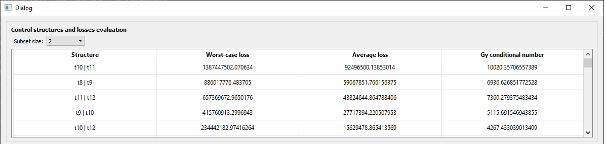

*********************************************************************
Indirect composition control of a Propene/Propane Distillation Column
*********************************************************************

The system depicted in :numref:`c3splitterflowsheet` consists of
the separation of propene from a binary mixture with propane in a 146
stage distillation column. :cite:`alves2018` showed that the
best set of self-optimizing controlled variables as single measurements
for this system are the composition of propene in the distillate and
bottom products at their respective optimum nominal values. However,
because direct control of composition is known to be difficult due to
unreliability and slow dynamics of online analyzers, it may be better to
use indirect control which is when control of primary variables can be
achieved by selecting secondary variables such that the setpoint error
is minimized. *Metacontrol* can also handle indirect control
formulations since they are simply a special case of the exact local
method :cite:`halvorsen03,hori05,alstad09`.

   Flowsheet of the propene distillation column.

The objective is to minimize the relative steady-state deviation in :eq:`c3_j` :cite:`hori08`.

.. math::
   :label: c3_j

   J = \left(\frac{x_{\text{top }}^{\mathrm{propene}}
       -x_{\text{top,setpoint}}^{\mathrm{propene}}}
       {x_{\text{top,setpoint}}^{\mathrm{propene}}}\right)^{2}
       +\left(\frac{x_{\text{bottom}}^{\mathrm{propene}}
       -x_{\text{bottom,setpoint}}^{\mathrm{propene}}}{x_{\text{bottom,setpoint}}
       ^{\mathrm{propene}}}\right)^{2}
       \label{eq:indirectindex}

where :math:`x_{\text{top,setpoint}}^{\mathrm{propene}} = 0.995` and
:math:`x_{\text{bottom,setpoint}}^{\mathrm{propene}} = 0.05`
:cite:`alves2018`, subject to

-  C-1: Reboiler duty :math:`\leq 80 GJ/h`

using the reflux ratio and the distillate to feed ratio as available
degrees of freedom.

The main process disturbances are :cite:`alves2018`:

-  D-1: Feed propylene flowrate

-  D-2: Feed propane flowrate

-  D-3: Feed vapor fraction (:math:`\phi`)

A typical temperature profile for the C3 splitter is shown in :numref:`c3-temperature-profile`
, and since temperature is easy to measure,
some particular stage temperatures along the column were chosen as
candidate controlled variables based on the slope criterion of
:cite:`luyben2006`. It is then expected that temperatures
close to the top are poor choices of measurements vis-a-vis the ones
close to the bottom (considering a top-down stage numbering). Moreover,
some flows and flow ratios were also considered as candidates (see :numref:`tablecvs`).

   Temperature profile.

.. table:: Candidate controlled variables for the C3 splitter problem.
   :name: tablecvs
   :align: center

   +----------------------------------+----------------------------------+
   | **Variable** (alias used in      | **Description**                  |
   | *Metacontrol*)                   |                                  |
   +==================================+==================================+
   | bf                               | Bottoms to feed ratio            |
   +----------------------------------+----------------------------------+
   | vf                               | Boilup to feed ratio             |
   +----------------------------------+----------------------------------+
   | lf                               | Reflux to feed ratio             |
   +----------------------------------+----------------------------------+
   | rrcv                             | Reflux ratio                     |
   +----------------------------------+----------------------------------+
   | dfcv                             | Distilalte to feed ratio         |
   +----------------------------------+----------------------------------+
   | l                                | Reflux rate :math:`(kmol/h)`     |
   +----------------------------------+----------------------------------+
   | v                                | Boliup rate :math:`(kmol/h)`     |
   +----------------------------------+----------------------------------+
   | t8                               | Stage 8 temperature              |
   |                                  | :math:`(°C)`                     |
   +----------------------------------+----------------------------------+
   | t9                               | Stage 9 temperature              |
   |                                  | :math:`(°C)`                     |
   +----------------------------------+----------------------------------+
   | t10                              | Stage 10 temperature             |
   |                                  | :math:`(°C)`                     |
   +----------------------------------+----------------------------------+
   | t11                              | Stage 11 temperature             |
   |                                  | :math:`(°C)`                     |
   +----------------------------------+----------------------------------+
   | t12                              | Stage 12 temperature             |
   |                                  | 4\ :math:`(°C)`                  |
   +----------------------------------+----------------------------------+
   | t129                             | Stage 129 temperature            |
   |                                  | :math:`(°C)`                     |
   +----------------------------------+----------------------------------+
   | t130                             | Stage 130 temperature            |
   |                                  | :math:`(°C)`                     |
   +----------------------------------+----------------------------------+
   | t131                             | Stage 131 temperature            |
   |                                  | :math:`(°C)`                     |
   +----------------------------------+----------------------------------+
   | t132                             | Stage 132 temperature            |
   |                                  | :math:`(°C)`                     |
   +----------------------------------+----------------------------------+
   | t133                             | Stage 133 temperature            |
   |                                  | :math:`(°C)`                     |
   +----------------------------------+----------------------------------+
   | t134                             | Stage 134 temperature            |
   |                                  | :math:`(°C)`                     |
   +----------------------------------+----------------------------------+
   | t135                             | Stage 135 temperature            |
   |                                  | :math:`(°C)`                     |
   +----------------------------------+----------------------------------+
   | t136                             | Stage 136 temperature            |
   |                                  | :math:`(°C)`                     |
   +----------------------------------+----------------------------------+

With 20 candidate controlled variables and 2 degrees of freedom there are :math:`\binom{20!}{2!} = \frac{20!}{2!\times(20-2)!} = 190`
possible control configurations of single measurements, and the evaluation of all of these one at the time is a very tedious task.
:numref:`c3splitterload` and :numref:`c3splitterloadvar` shows the problem setup in *Metacontrol*.

   Problem setup for the C3 splitter column process.

   Aspen Plus variable load for the C3 splitter column process.

A total of 60 initial points were sampled (:numref:`c3-sampling`) and refined by the algorithm of :cite:`caballero2008` in *Metacontrol* to find the optimal nominal 
operating point. Using a K-fold validation, it was observed that the 
quadratic regression polynomial (poly2) yielded the most accurate Kriging
metamodel. This is indeed a valuable feature 
of *Metacontrol* for it systematically informs which regression model provides 
the most promising results. (:numref:`c3splitterpoly0`- :numref:`c3splitterpoly2`.)

   Initial sampling for the C3 Splitter case study and the bounds considered.

   K-fold validation metric for constant (poly0) regression model.

   K-fold validation metric for linear (poly1) regression model.

.. figure:: ../images/c3splitterpoly2.PNG
   :name: c3splitterpoly2
   :align: center

   K-fold validation metric for linear (poly2) regression model.

:numref:`c3splitteropt` reports the results of the optimization in 
*Metacontrol*. As there are no active constraints, two unconstrained 
degrees of freedom are left for self-optimizing control purposes.
:numref:`tableopt` shows that the optimization conducted in 
Aspen Plus matches the one in *Metacontrol*.

   Refinement algorithm log output.

.. table:: Results of the optimization of the C3 splitter process in Aspen Plus and Metacontrol for the decision variables and objective function.
   :name: tableopt
   :align: center

   +-------------+------------------------------+--------------+--------------------------+
   |             | Objective function           | Reflux Ratio | Distallate to feed ratio |
   +-------------+------------------------------+--------------+--------------------------+
   | Aspen Plus  | :math:`7.47 \times 10^{-15}` | 13.5246      | 0.6349                   |
   +-------------+------------------------------+--------------+--------------------------+
   | Metacontrol | :math:`5.92 \times 10^{-10}` | 13.5159      | 0.6349                   |
   +-------------+------------------------------+--------------+--------------------------+

With no active constraints to be implemented in the process simulator, the 
reduced space Kriging metamodel was built using the same .bkp file of 
the optimization step (:numref:`c3_reduced_space` and 
:numref:`c3_point_file`). Here the reduced space 
sampling was done within *Metacontrol*, reducing the need to navigate between 
applications.

.. figure:: ../images/c3splitter-reduced-space.PNG
   :name: c3_reduced_space
   :align: center

   Reduced space problem sampling using a .*bkp file.

.. figure:: ../images/c3splitter-point-file.PNG
   :name: c3_point_file
   :align: center

   Pointing to the .*bkp file location.

Hitting the "Open sampling assistant" 
button (1) in :numref:`c3splitterredspacefile` opens the window (2) where 
the parameters of the sampling method can be set (3) and the data generated (4). 
The sampling can also be controlled (5), and the user can abort the process at any 
moment (6), or export the results as a .csv file (7).

.. figure:: ../images/c3splitter-redspace-sampling.PNG
   :name: c3splitterredspacefile
   :align: center

   Sampling assistant for the reduced space metamodel construction.

Gradients and Hessians for the self-optimizing control formulas are generated at the 
"Differential Data" tab of Figure :numref:`c3splittergrad`. The gradients computed by *Metacontrol* were 
compared against the ones generated by the process simulator (:numref:`c3splitter_table_grads`). 
Not surprisingly they were virtually identical, 
which is an evidence of the robustness of the previously proposed methodology 
of :cite:`alves2018` that is implemented in *Metacontrol*.

   Computation of derivatives in *Metacontrol*.

   Comparison between Aspen Plus and *Metacontrol* gradient results.

The magnitude of disturbances in this case were :math:`10\%` for 
each component feed flow rate and :math:`10\%` for the feed vapor fraction. The 
measurement errors were :math:`0.001` for flow rates and flow ratios, and :math:`0.5°C`
for temperatures, a value that can realistically represent thermocouples and RTD 
sensor accuracies typically encountered in industry. Moreover, all 190 possible 
candidate controlled variables for the single measurement policy were considered. 
For linear combinations of measurements as candidate controlled variables, the 
50 best subsets for each size were evaluated. This information was carefully 
specified in the "Self-Optimizing Control" tab of :numref:`c3splittersocinput`.

.. figure:: ../images/c3splittersocinput.PNG
   :name: c3splittersocinput
   :align: center

   Defining parameters for self-optimizing computations.

The results for the single measurement policy (:numref:`c3cvgood`) 
show that selecting sensitive temperatures and flow rates 
or flow ratios yields configurations capable of indirect controlling both 
distillate and bottom compositions with small incurred losses, while choosing 
less sensitive temperatures results in large setpoint deviations 
(:numref:`c3cvtempbad`) with substantial losses :cite:`alves2018,hori07`. 
This result is also an instance of the slope criterion of :cite:`luyben2006` 
as a good starting assumption for deciding which variables should be controlled. 
The main difference is that the mathematical framework of Self-Optimizing Control 
incorporates these heuristics in a neat, systematic way.

.. figure:: ../images/c3splitter-good-cvs-size-2.PNG
   :name: c3cvgood
   :align: center

   Best sets of controlled variables for the single measurement policy 
   showing small losses when selecting sensitive temperatures and flow rates 
   or flow ratios.

   Worst sets of controlled variables for the single measurement policy 
   showing larger losses when selecting less sensitive temperatures. This is 
   the same :numref:`c3cvgood` sorted by worst-case losses in 
   descending order.

:numref:`c3ss3`-:numref:`c3ssall` show the results when linearly 
combining measurements for subsets of sizes 3, 6, 9, and 20 (using all 
measurements). Intuitively, the larger the number of measurements, the smaller 
the losses and the more complex the configurations with many measurements to 
combine, which shows a clear compromise between accepting greater losses and 
making the control scheme more tractable.

.. figure:: ../images/c3splitter-good-cvs-size-3.PNG
   :name: c3ss3
   :align: center

   Best sets of linear combinations of 3 measurements.

.. figure:: ../images/c3splitter-good-cvs-size-6.PNG
   :name: c3ss6
   :align: center

   Best sets of linear combinations of 6 measurements.

.. figure:: ../images/c3splitter-good-cvs-size-9.PNG
   :name: c3ss9
   :align: center

   Best sets of linear combinations of 9 measurements.

   Best sets of linear combinations of all measurements.

===================
Dynamic simulations
===================

The best control structure that uses a linear combination of 3 measurements 
is chosen to evaluate the dynamic performance of this more complex control 
configuration for the C3-Splitter case study, where

.. math::

   Cv_1 = 0.00129t_{132} + 0.00126t_{133} + 0.00152vf

.. math::

   Cv_2 = 0.69671t_{132} + 0.69489t_{133} + 0.17807vf

The following plots clearly show that this choice is capable of dealing with  
disturbances in the composition of propene in the feed and total flow rate, 
while at the same time indirect controlling the primary variables. PI 
controllers tuned with the IMC rules and a process flowsheet depicting the 
control configuration in place is provided in :numref:`c3controlflowsheet`.

.. figure:: ../images/c3splitter_control_structure.svg
   :name: c3controlflowsheet
   :align: center

   Control structure tested.

.. plot:: images/pyplots/c3feedplus5.py
   :align: center

.. plot:: images/pyplots/c3feedminus5.py
   :align: center

.. plot:: images/pyplots/c3feedcompplus25.py
   :align: center

.. plot:: images/pyplots/c3feedcompminus25.py
   :align: center

.. plot:: images/pyplots/c3feedvfracplus10.py
   :align: center

