***************************************************************************************
Economic Self-Optimizing Control of a :math:`CO_{2}` Compression and Purification Unit
***************************************************************************************

.. figure:: ../images/CPU_Flowsheet.svg
	:name: cpuflowsheet
	:align: center

	Flowsheet of the CPU process.

The process consists in a :math:`CO_2` compression and purification unit 
(CPU) that uses phase separation to produce purified :math:`CO_2` from 
oxy-fuel combustion. This process is one of several capable of reducing the 
greenhouse effects on climate change 
:cite:`JIN2015` and it is based on the prototype proposed by the International 
Agency Greenhouse Gas (IEAGHG) R&D program study :cite:`dillon2005`. The 
modeling of the process depicted in :numref:`cpuflowsheet` is inspired 
on the work of :cite:`Liu2019` and :cite:`JIN2015` and was implemented in 
Aspen Plus. Flue gas is compressed by a three-stage after-cooled compressor 
(MCC) and then sent to the first multi-stream heat exchanger (E1) where it 
is cooled to :math:`-24.51°C` before separation in separator F1, the bottom 
of which consists of the first product stream. The top stream from F1 is the 
feed to the multi-stream heat exchanger (E2) where it is cooled to 
:math:`-54.69°C` before going to separator F2, the bottom of which consists 
of the second product stream that is compressed in C. The top stream from 
F2 is discarded as vent. Both :math:`CO_2` product streams and the vent gas 
are reheated on the multi-stream heat exchangers, and the :math:`CO_2` 
product streams are mixed and sent to storage.

The objective is to reduce specific energy consumption by minimizing the 
cost function in :eq:`eq1` :cite:`Liu2019`

.. math::
	:label: eq1

	J[kWh/{tCO_2}]=\frac{W_{\mathrm{MCC}}+W_{\mathrm{C}}}{F_{\mathrm{CO}_{2}}}

where :math:`W_{\mathrm{MCC}}` and :math:`W_{\mathrm{C}}` are the energy 
consumption of the compressors, and :math:`F_{\mathrm{CO}_2}` is the 
:math:`CO_2` feed flow rate.

The constraints to the process are :cite:`JIN2015,Liu2019,dillon2005`:

#. C-1: :math:`CO_2` recovery rate :math:`\geq 90 \%`
#. C-2: :math:`CO_2` purity on product stream  :math:`\geq 96 \%`
#. C-3: Temperature of F2 bottom stream :math:`>-56.6°C`

C-1 is an environmental requirement :cite:`Liu2019` to guarantee reduced 
:math:`CO_2` atmospheric emissions 
:cite:`TOFTEGAARD2010581,BUHRE2005283`, C-2 is a product specification used 
to prevent excessive energy consumption :cite:`POSCH2012254`, and C-3 is there 
to avoid :math:`CO_2` solidification in the pipeline since that bound 
corresponds to the :math:`CO_2` three-phase freezing point 
:cite:`POSCH2012254,KOOHESTANIAN2017570`.
	
The main disturbances to the process are :cite:`Liu2019`:

#. D-1: Flue gas flow rate
#. D-2: :math:`CO_2` concentration in the flue gas
	
D-1 and D-2 are the result of the oxy-fuel combustion boiler island 
:cite:`Liu2019`, given the variations on the boiler operation. The amplitude 
of variation was taken to :math:`\pm 5 \%` of the base-case in both disturbances 
:cite:`Liu2019,JIN2015`.

There are four steady-state degrees of freedom :cite:`Liu2019,JIN2015`
	
#. MCC outlet pressure (bar)
#. MCC outlet temperature :math:`(°C)`
#. F1 temperature :math:`(°C)`
#. F2 temperature :math:`(°C)`

:numref:`cpuvars` lists the candidate controlled variables considered for this
case.

.. table:: Candidate controlled variables for :math:`CO_2` CPU process.
	:name: cpuvars
	:align: center

	+--------------------------------------------+-----------------------------------------------+
	| **Variable** (alias used in *Metacontrol*) | **Description**                               |
	+============================================+===============================================+
	| mccp/mccpout                               | Compressor outlet pressure (bar)              |
	+--------------------------------------------+-----------------------------------------------+
	| mcct/mcctout                               | Compressor outlet temperature :math:`(°C)`    |
	+--------------------------------------------+-----------------------------------------------+
	| f1t/f1tout                                 | F1 temperature :math:`(°C)`                   |
	+--------------------------------------------+-----------------------------------------------+
	| f2t/f2tout                                 | F2 temperature  :math:`(°C)`                  |
	+--------------------------------------------+-----------------------------------------------+
	| s8t                                        | S8 stream temperature :math:`(°C)`            |
	+--------------------------------------------+-----------------------------------------------+
	| fco2out                                    | :math:`CO_{2}` product flowrate :math:`(t/h)` |
	+--------------------------------------------+-----------------------------------------------+
	| xco2out                                    | :math:`CO_{2}` product molar fraction         |
	+--------------------------------------------+-----------------------------------------------+
	| co2rr                                      | :math:`CO_{2}` recovery rate                  |
	+--------------------------------------------+-----------------------------------------------+

With 4 degrees of freedom and 8 candidate controlled variables there are 
:math:`\binom{8!}{4!} = \frac{8!}{4!\times(8-4)!} = 70` possible control 
configurations for the single measurement policy, and the evaluation of each, 
one at a time, is definitely a tedious task especially if the procedure is not 
automated. That is exactly when *Metacontrol* is most needed.
	
The first step is to populate *Metacontrol* with the necessary process 
variables from the model in Aspen Plus using the COM interface. 
:numref:`mainscreen`-:numref:`loadvar` illustrate the process of loading a 
\*.bkp Aspen Plus file, selecting the relevant variables, and creating aliases. 
Note that the \*.bkp file must be compatible with the Aspen Plus version being 
used. The main window of :numref:`mainscreen` displays relevant 
information on the simulation in Aspen Plus such as block and stream names, 
flowsheet options (optimizations, sensitivities, calculators), the selected 
chemical species, and the thermodynamic package used.

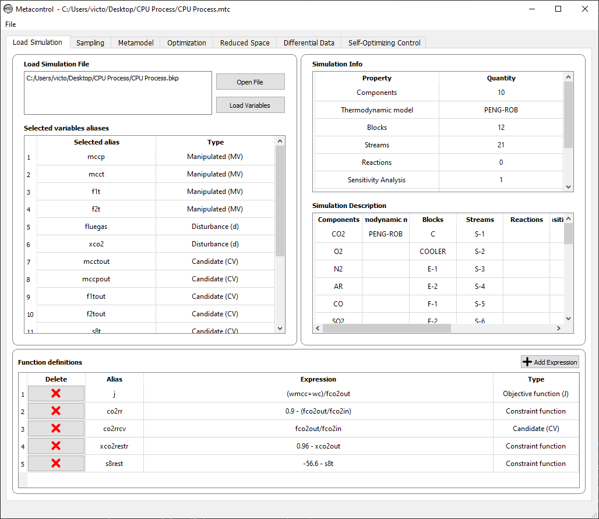
	
	*Metacontrol* main screen with the :math:`CO_2` CPU 
	process simulation file loaded. Note the vast display of information 
	of the simulation from Aspen Plus.

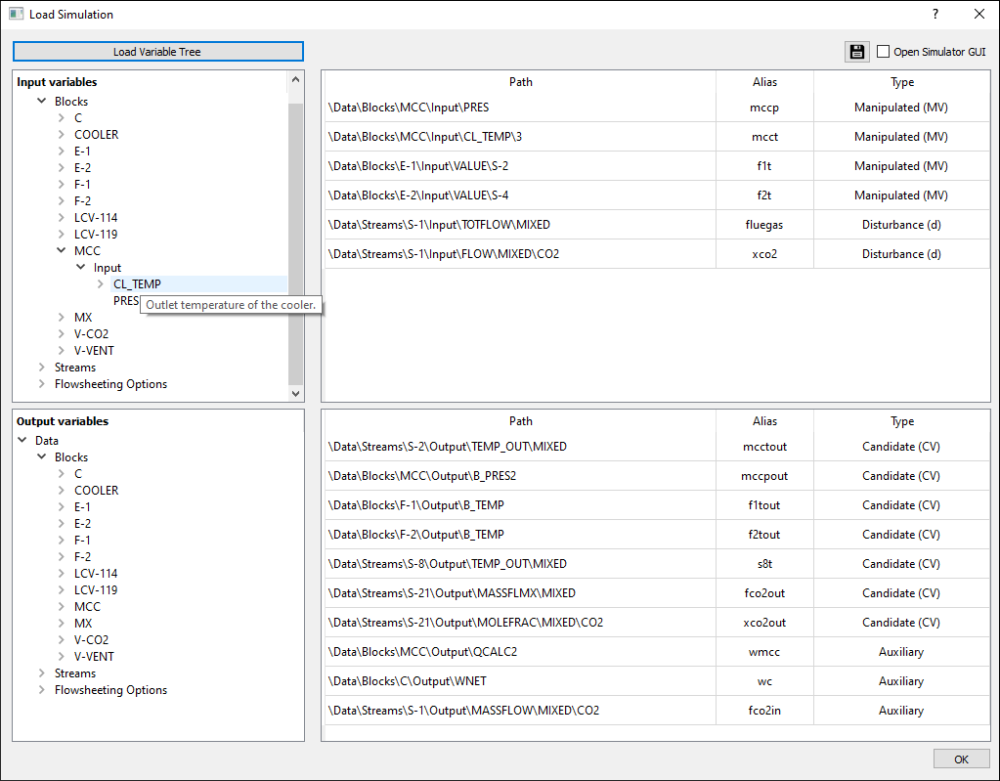

	Loading variables for the :math:`CO_2` CPU process from 
	Aspen Plus simulation and creating aliases. At the top right corner of this 
	screen	the user is able to select the option to reveal the GUI from Aspen 
	Plus. This features allows for the inspection of the flowsheet in the process 
	simulator to check for any stream or block name. Hovering the mouse over 
	a COM variable on the GUI brings its description.

After selecting the relevant variables and define their types in the window of 
:numref:`loadvar` the user can go back to the main screen where 
expressions can be created for the objective function, candidate controlled 
variables and constraints using the variables from the process simulator. 
:numref:`mainscreen` also shows the construction of such expressions for 
the :math:`CO_2` CPU process using the auxiliary variables selected in 
:numref:`loadvar`.
	
The user can then generate the design of experiments (DOE) to build the 
*Kriging* responses of the objective function, candidate controlled 
variables, and process constraints (:numref:`lhs1`-:numref:`lhs3`). 
The ranges for each decision variable for the :math:`CO_2` CPU process 
were taken from :cite:`JIN2015`, which are automatically included as additional 
constraints to the problem formulation.
	
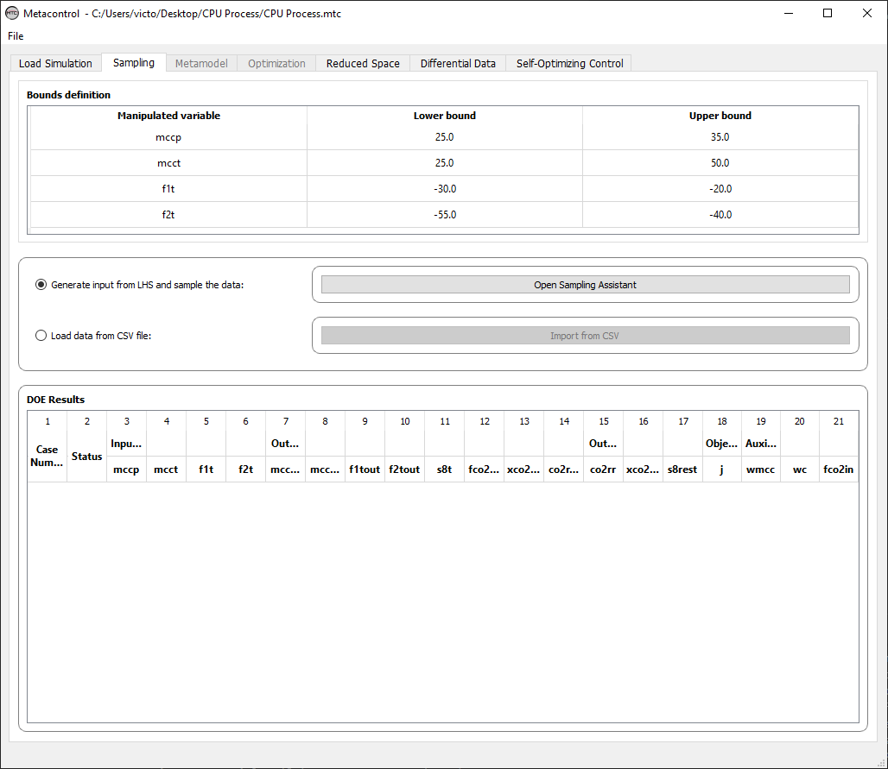
	
	Metacontrol sampling panel. The user can perform the sampling using the 
	process simulator or importing a \*.csv file.

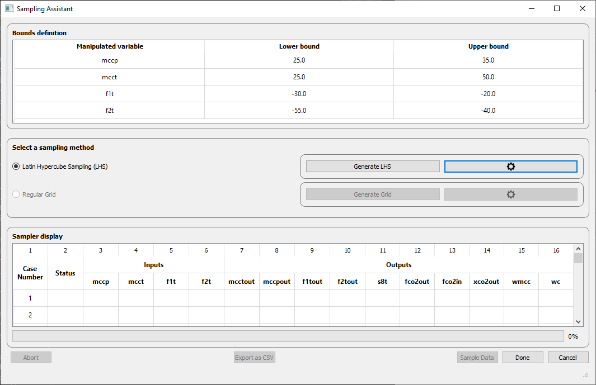
		
	*Metacontrol* sampling assistant. The limits for the 
	decision variables used in the :math:`CO_2` CPU process are the 
	same used in :cite:`JIN2015` and :cite:`Liu2019`

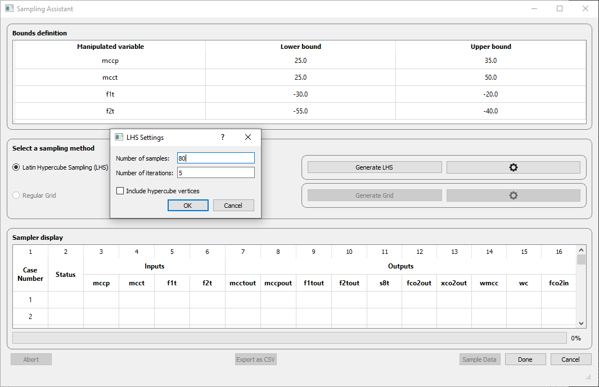
		
	*Metacontrol* Latin Hypercube Sampling settings. 80 
	samples were generated and 5 iterations were performed to 
	maximize the minimum distance between the points (*maxmin* 
	criterion). The user can also choose to add the vertices to the design.

After setting up the LHS, *Metacontrol* automatically runs each case in 
Aspen Plus via COM interface, communicating the results in the window showed in 
:numref:`lhs4`. After running all cases the user can then inspect the 
results of the design of experiments in a tabular form as depicted in 
:numref:`lhs5`.
	
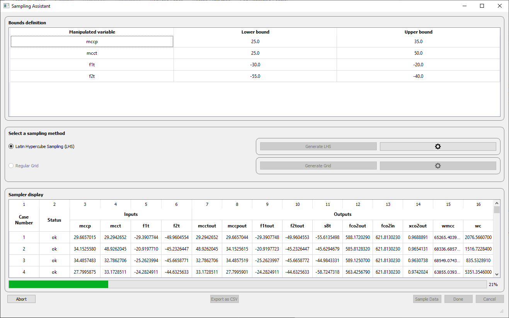
		
	*Metacontrol* Sampling for the :math:`CO_2` CPU process.
		
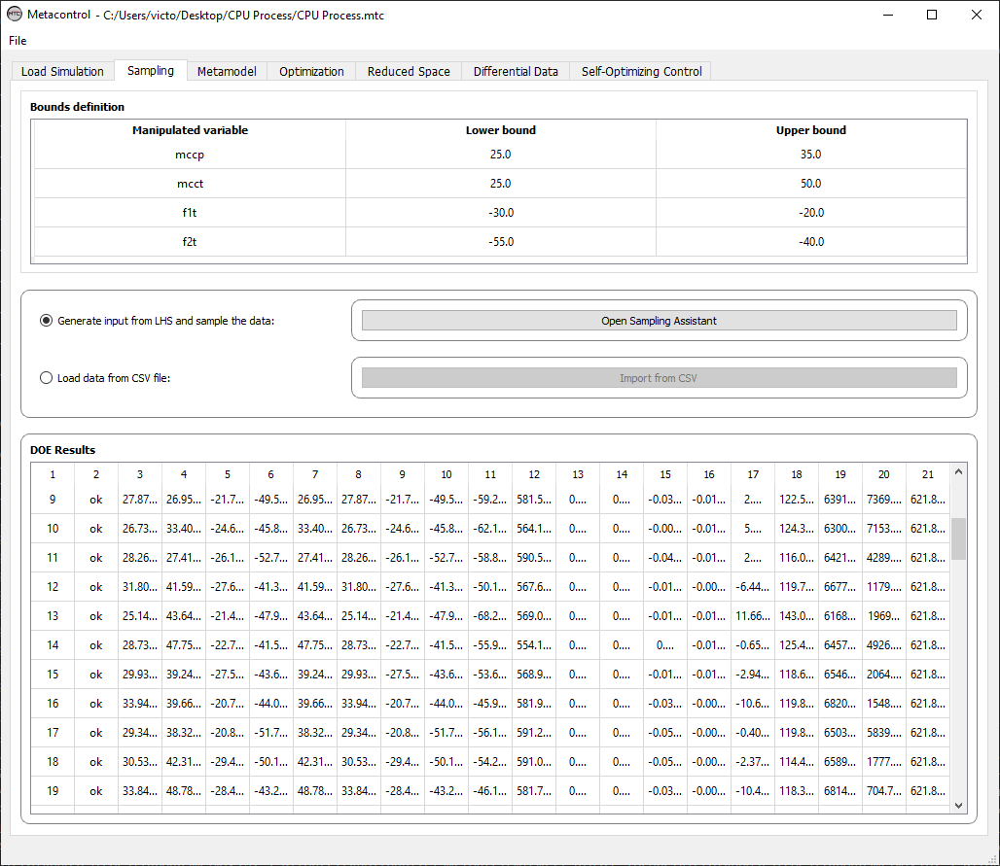
		
	Sampling results where the user can inspect convergence status 
	and the values of the selected variables for each case.
	
Now the *Kriging* metamodel can be built. In the "Metamodel"	
Panel (:numref:`krigingresults`) the user can select the response 
variables, define (initial) values for the bounds of the *Kriging* 
hyperparameters (:math:`\theta`), choose regression and correlation models, and 
define the type of validation to be conducted. After hitting the button 
"Generate Metamodel", the *Kriging* metamodel is generated, and if 
*Hold-out* is chosen as the validation mode it is possible to view the 
fitting results of each generated *Kriging* interpolator, as showed in 
:numref:`plotkr`. Moreover, good-of-fitness can be assessed by the 
available metrics Mean squared error (MSE), Root mean squared error (RMSE), 
Mean absolute error (MAE), R\textsuperscript{2} linear coefficient,	Explained 
variance (EV), the Sample mean and also its standard deviation. It is important 
to point out that this first metamodel generation is performed only to allow 
for a quick view of the initial sampling, i.e., to check if the initial 
sampling is acceptable to be refined by the algorithm of :cite:`caballero2008` 
implemented in *Metacontrol*.

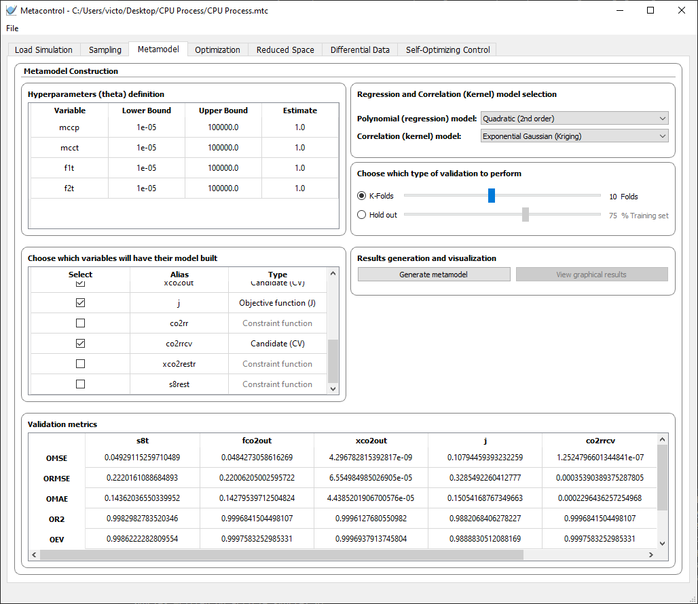
	
	Kriging configuration and validation metric results.

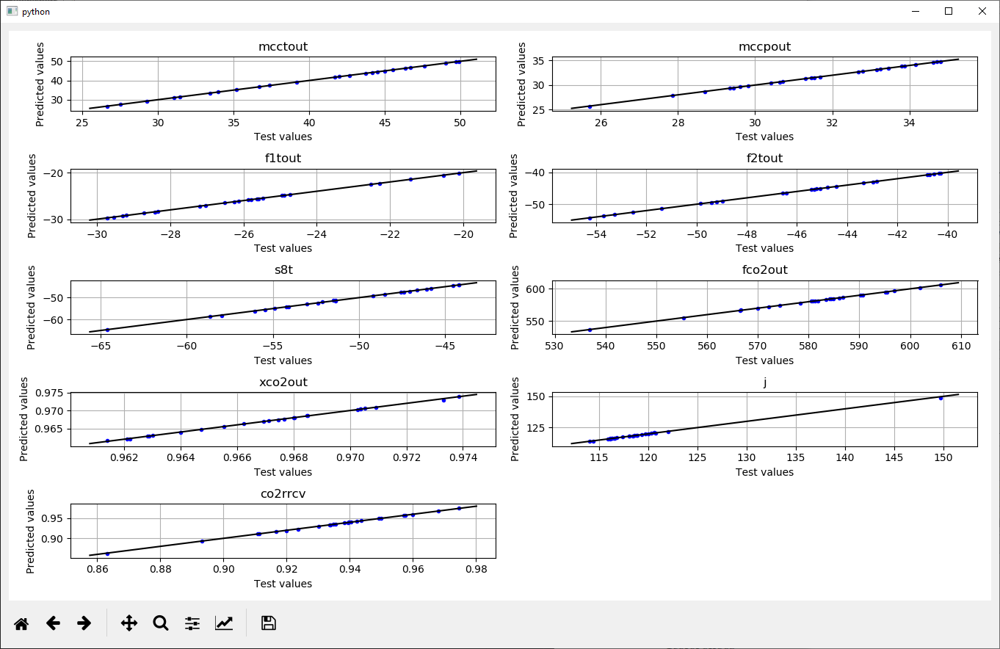
	
	Graphical validation for each metamodel.

The next step happens at the "Optimization" tab 
(:numref:`caballeroscreen`) where advanced parameters of the algorithm 
of :cite:`caballero2008` and of the NLP solver can be tuned to improve the 
optimization of the *Kriging* interpolator. The 
final result of the refinement algorithm can be seen in the "Results" 
panel of :numref:`caballeroscreen` where the optimal values of the 
decision variables, constraint expressions, and the objective function are 
displayed. In addition, a log of the operations of contraction and movement of 
the hyperspace as the optimization progresses is showed.

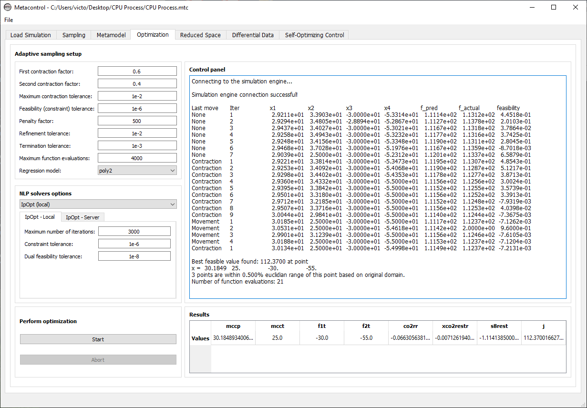
	
	Refinement algorithm configuration and results screen.

:numref:`optcomparison1` and :numref:`optcomparison2` shows the results 
of the optimization conducted at different conditions. Note there is almost no 
difference between the results of *Metacontrol* using the algorithm of 
:cite:`caballero2008` and Aspen Plus using the SQP algorithm, whereas for the 
optimization of the initial *Kriging* metamodel without refinement there 
is some discrepancy, as expected :cite:`forrester2008,jones2001,caballero2008`.

.. table:: Results of the optimization of the :math:`CO_2` CPU process in Aspen Plus and *Metacontrol* for the decision variables and objective function.
	:name: optcomparison1
	:align: center
	:widths: auto

	+-------------------+------------------------------------------------+--------------------+-------------------------------------+-----------------------------+-----------------------------+
	|                   | Objective function J (:math:`\frac{kW}{CO_2}`) | MCC Pressure (var) | MCC Outlet Temperature (:math:`°C`) | F1 Temperature (:math:`°C`) | F2 Temperature (:math:`°C`) |
	+===================+================================================+====================+=====================================+=============================+=============================+
	|     Aspen Plus    | 112.3690                                       | 30.0316            | 25.0                                | -30.0                       | -55.0                       |
	+-------------------+------------------------------------------------+--------------------+-------------------------------------+-----------------------------+-----------------------------+
	|   *Metacontrol*   | 112.3691                                       | 30.1849            | 25.0                                | -30.0                       | -55.0                       |
	+-------------------+------------------------------------------------+--------------------+-------------------------------------+-----------------------------+-----------------------------+
	| Initial *Kriging* | 113.5488                                       | 29.6672            | 34.8                                | -29.6                       | -52.3                       |
	+-------------------+------------------------------------------------+--------------------+-------------------------------------+-----------------------------+-----------------------------+

.. table:: Results of the optimization of the :math:`CO_2` CPU process in Aspen Plus and *Metacontrol* for the process constraints.
	:name: optcomparison2
	:align: center
	:widths: auto

	+-------------------+------------------------------------+-----------------------------+----------------------------+
	|                   | Stream S8 temperature (:math:`°C`) | :math:`CO_2` molar fraction | :math:`CO_2` recovery rate |
	+===================+====================================+=============================+============================+
	| Aspen Plus        | -55.8201                           | 0.9674                      | 0.9658                     |
	+-------------------+------------------------------------+-----------------------------+----------------------------+
	| *Metacontrol*     | -55.4859                           | 0.9666                      | 0.9671                     |
	+-------------------+------------------------------------+-----------------------------+----------------------------+
	| Initial *Kriging* | -56.0041                           |  0.9685                     | 0.9553                     |
	+-------------------+------------------------------------+-----------------------------+----------------------------+

Three constraints were active at their lower bounds, namely the MCC outlet 
temperature and the temperatures of separators F1 and F2, and they need to be 
controlled for optimal operation (active constraint control). They are 
implemented in the simulation in Aspen Plus, e.g., either as input specifications or 
design specs, and then a 
*Kriging* metamodel representing the reduced space problem with only 
one degree of freedom left for self-optimizing control is generated either 
in a procedure similar to the generation of the initial *Kriging* 
metamodel or by importing a \*.csv file with the results of the simulation runs. 
The latter might be considered when convergence is hard to achieve due to extra 
"feedback" loops caused by the implementation of active constraints in the 
process simulator or when the user feels more comfortable of running each 
case one at a time. In this case study, the \*.csv import feature was showcased
to illustrate its usage to the reader.

At the "Reduced space" tab (:numref:`variableactivity`), on the 
"Variable activity" panel, the constraints that were active at the 
optimal solution must be marked together with the remaining independent variables not
used to implement the active constraints in the process simulator (*i.e.*, the unconstrained
degrees of freedom). Also the values 
for the nominal 
disturbances must be specified. When sampling the reduced space problem using 
the process simulator via *Metacontrol*, the range of the remaining 
decision variables and disturbances must also be defined. It goes without 
saying that this range should be as small as possible (around :math:`\pm 0.5\%` of 
the nominal optimum) to produce a surrogate model accurate enough at the optimal 
region in order to guarantee robust gradients and Hessians :cite:`alves2018`.

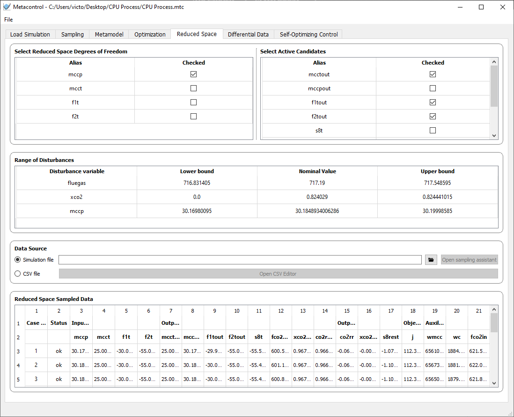
	
	"Reduced space" tab to define the reduced space model 
	requirements.

A \*.csv file containing the results of a sensitivity analysis conducted in the 
process simulator under active constraint control was loaded in 
*Metacontrol*, as illustrated in :numref:`csvassociate`. Note that the 
denominations of the variables in the \*.csv file must be associated to the respective 
variables in *Metacontrol*.

.. figure:: ../images/csvassociate.PNG
	:name: csvassociate
	:align: center
	
	Associating each alias created in *Metacontrol* to each 
	column of the \*.csv data.

Now that the data is available, the reduced space *Kriging* metamodel 
can be generated. Under the panel "Reduced space metamodel training" 
on the "Differential data" tab (black rectangle in 
:numref:`gradresults`), hitting the button "Open training dialog" 
allows for the tuning of the *Kriging* parameters and metamodel 
construction (:numref:`krigingredspace`).

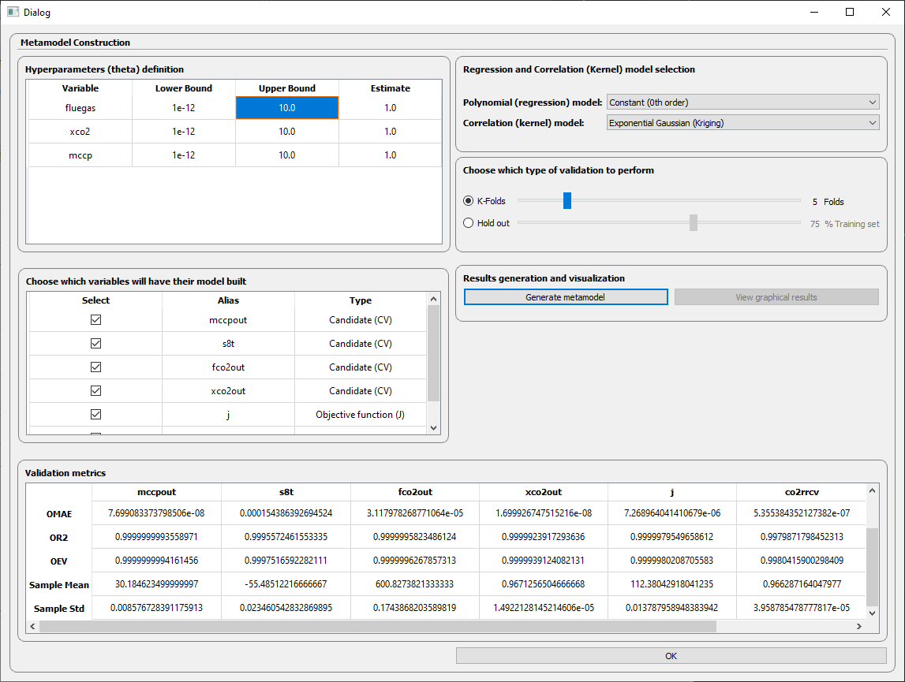
	
	Generating the reduced space metamodel for the :math:`CO_2` 
	CPU process.

Heading back to the previous screen (:numref:`gradresults`), 
gradients and Hessians necessary to carry on the Self-Optimizing control 
analysis can be computed  via analytical expressions of the these derivatives 
as developed by :cite:`DACE` and :cite:`alves2018`. For this case, the gradients 
calculated in *Metacontrol* agree with those provided by Aspen Plus 
under the Equation Oriented mode, as shown in :numref:`gradcomparison` 
(note the mean-squared errors are very small).

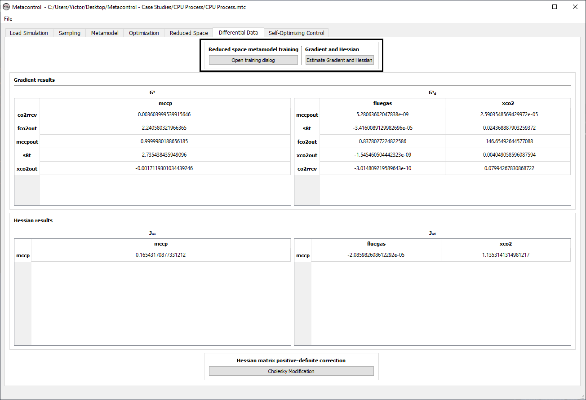
	
	Computation of derivatives in *Metacontrol.*

.. table:: Comparison between Aspen Plus and *Metacontrol* gradient results.
	:name: gradcomparison
	:align: center
	:widths: auto

	+--------------------+--------------------------------------------------------------------------------------------------------------------------------------------+---------------------------------------------------------------------------------------------------------------------------------------------------------------------------------------------------------------------------------------------------------------------+
	|                    | :math:`G^{y}`                                                                                                                              | :math:`G_{d}^y`                                                                                                                                                                                                                                                     |
	+====================+============================================================================================================================================+=====================================================================================================================================================================================================================================================================+
	| *Metacontrol*      | :math:`\begin{bmatrix} 0.00360399953991565\\ 2.24058032196637\\ 0.999998018865619\\ 2.73543843594910\\ -0.00171193010344392 \end{bmatrix}` | :math:`\begin{bmatrix} -3.01480921958964e-10 & 0.0799426783086872\\ 0.837802722482259  & 146.654926445771\\ 5.28063602047838e-09  & 2.59035485694300e-05\\ -3.41600891299827e-05  & 0.0243688879032594\\ -1.54546050444232e-09 & 0.00404905859608759 \end{bmatrix}` |
	+--------------------+--------------------------------------------------------------------------------------------------------------------------------------------+---------------------------------------------------------------------------------------------------------------------------------------------------------------------------------------------------------------------------------------------------------------------+
	| Aspen Plus         | :math:`\begin{bmatrix} 0.00360289000000000\\ 2.24032100000000\\ 1\\ 2.73303800000000\\ -0.00171230000000000 \end{bmatrix}`                 | :math:`\begin{bmatrix} 1.34722000000000e-07 & 0.0798491000000000\\ 0.837799400000000 & 146.612400000000\\ 0 & 0 \\ 3.37970000000000e-15 & 0.0249510000000000\\ 1.69120000000000e-16 & 0.00404464000000000 \end{bmatrix}`                                            |
	+--------------------+--------------------------------------------------------------------------------------------------------------------------------------------+---------------------------------------------------------------------------------------------------------------------------------------------------------------------------------------------------------------------------------------------------------------------+
	| Mean-squared error | 1.16586918414966e-06                                                                                                                       | 1.8088e-04                                                                                                                                                                                                                                                          |
	+--------------------+--------------------------------------------------------------------------------------------------------------------------------------------+---------------------------------------------------------------------------------------------------------------------------------------------------------------------------------------------------------------------------------------------------------------------+

As a requirement of the procedure, the magnitude of disturbances and measurement 
errors can be specified in the "Self-Optimizing Control" tab (
:numref:`socinput`). For the :math:`CO_{2}` inlet composition this magnitude was :math:`0.05` 
and for the flue gas flow rate it was considered :math:`5\%` of the nominal optimum value. The 
measurement errors were set to :math:`0.5°C` for temperatures, :math:`0.01` for pressures 
and flow rates, and :math:`0.001` for ratios (:math:`CO_{2}` recovery rate and product purity). 
The number of best subsets of a given size to be evaluated as possible 
candidates was specified under the "Subsets sizing options" panel. By 
clicking on the "Generate results" button a dialog window shows the results 
of the self-optimizing control calculations. 

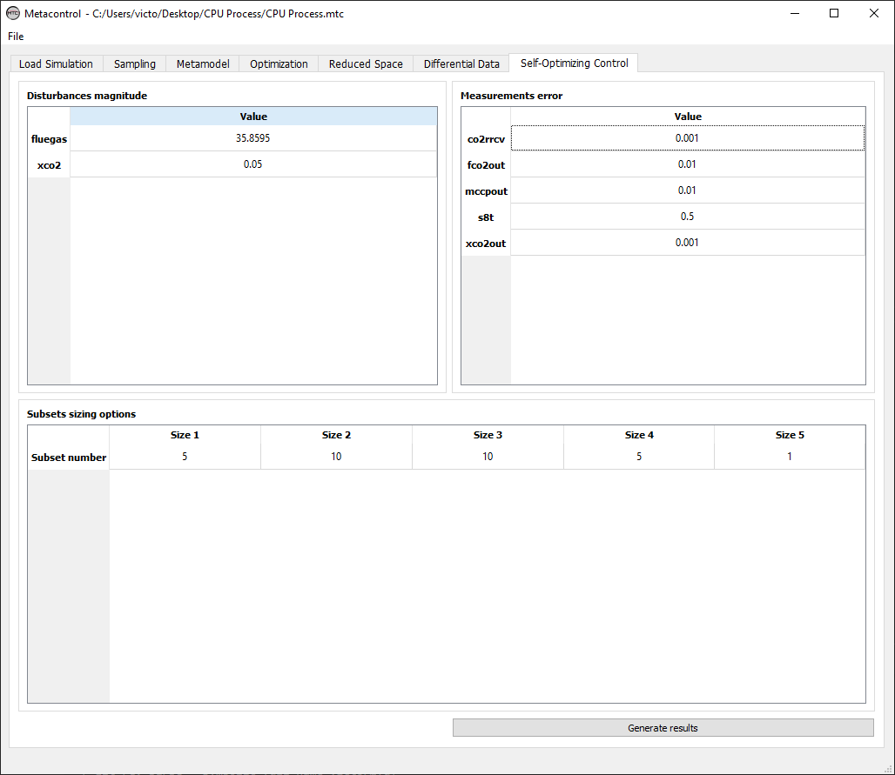
	
	Defining parameters for self-optimizing computations.

:numref:`socresultss1` and :numref:`socresultss2` detail the results for the 
single measurement policy (subset size 1) and for the configuration using a 
linear combinations of 2 measurements (subset size 2), respectively. Also 
depicted are the :math:`H` matrix and the optimal sensitivity matrix :math:`F` for each 
subset. 

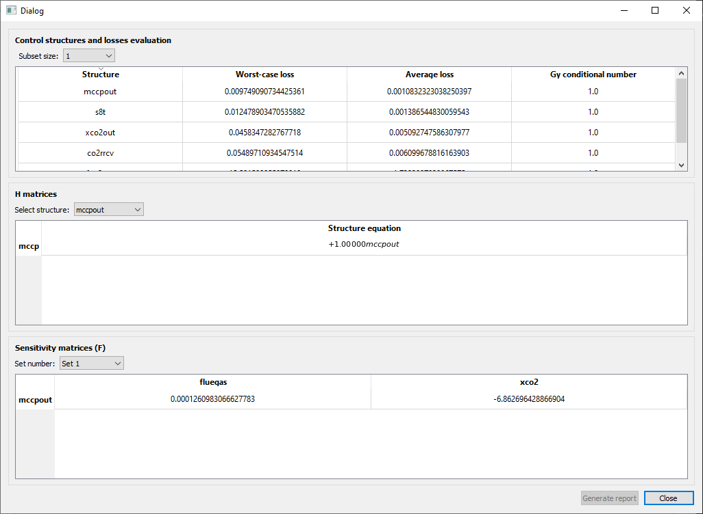
	
	Best selected controlled variables for the single measurement policy.

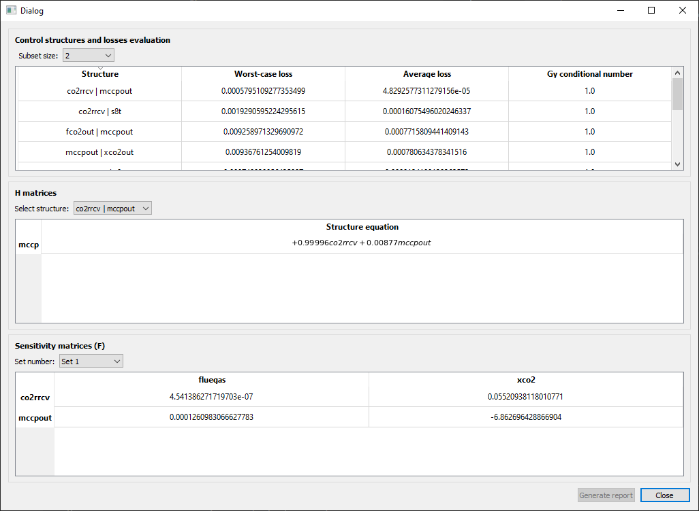
	
	Best selected controlled variables for linear combinations of 2 
	measurements.

:numref:`bestcvscpu1` is a summary of the results for the single 
measurement policy showing that controlling the multi-stage compressor (MCC) 
outlet pressure at its nominal optimal value leads to (near) optimal operation, 
despite of disturbances and measurement errors. This result compares to the 
previous findings of :cite:`Liu2019`, where similar control structures were proposed.
However, they heuristically assumed  control  of  process constraints in contrast 
to the SOC  procedure used in *Metacontrol*.

.. table:: Best Self-Optimizing Control variables found by *Metacontrol* for the single measurement policy.
	:name: bestcvscpu1
	:align: center
	:widths: auto

	+----------------------+----------------------------+----------------------------+
	| Candidate controlled | Worst-Case                 | Average-Case               |
	+----------------------+----------------------------+----------------------------+
	| variable             | Loss :math:`(kWh/tCO_{2})` | Loss :math:`(kWh/tCO_{2})` |
	+----------------------+----------------------------+----------------------------+
	| mccpout              | 0.009749090734425361       | 0.0010832323038250397      |
	+----------------------+----------------------------+----------------------------+
	| s8t                  | 0.012478903470535882       | 0.001386544830059543       |
	+----------------------+----------------------------+----------------------------+
	| xco2out              | 0.0458347282767718         | 0.005092747586307977       |
	+----------------------+----------------------------+----------------------------+
	| co2rrcv              | 0.05489710934547514        | 0.006099678816163903       |
	+----------------------+----------------------------+----------------------------+
	| fco2out              | 15.591598055970818         | 1.7323997839967575         |
	+----------------------+----------------------------+----------------------------+

Dynamic simulations
===================

The dynamic evaluation of the control structure using the S-8 Stream 
temperature as the unconstrained controlled variable was performed 
according to the Single Temperature Control (STC) of :cite:`JIN2015`. 
Note that this choice of controlled variable was a consequence of the 
systematic procedure embedded in *Metacontrol*, and not an heuristic-based 
decision. Control of the MCC discharge pressure, though incurring in the 
lowest economic loss, was not considered on the basis of large flow rate 
fluctuations that can eventually come from the boiler island to upset the
CPU Process. The following plots show the result of dynamic simulations where 
it can be seen the robust performance of the proposed SOC-Based control 
configuration. It is worth mention that the constraint regarding stream 
S-8 lowest temperature due to :math:`CO_{2}` freezing point was not violated. 
Simple PI controllers were used, with IMC tuning rules and a process 
flowsheet depicting the control configuration in place is provided in 
:numref:`cpucontrolflowsheet`.

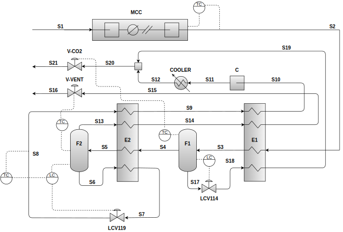

	Control structure tested.

.. plot:: images/pyplots/cpufeedplus5.py
	:align: center

.. plot:: images/pyplots/cpufeedminus5.py
	:align: center

.. plot:: images/pyplots/cpufeedcompplus25.py
	:align: center