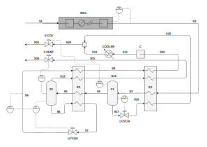

*****************************
Compression Purification Unit
*****************************

.. figure:: ../images/CPU_Flowsheet.svg
   :align: center

   Flowsheet of the CPU process.

Placeholder text...

Dynamic simulations
===================

The dynamic evaluation of the control structure using the S-8 Stream 
temperature as the unconstrained controlled variable was performed 
according to the Single Temperature Control (STC) of :cite:`JIN2015`. 
Note that this choice of controlled variable was a consequence of the 
systematic procedure embedded in *Metacontrol*, and not an heuristic-based 
decision. Control of the MCC discharge pressure, though incurring in the 
lowest economic loss, was not considered on the basis of large flow rate 
fluctuations that can eventually come from the boiler island to upset the
CPU Process. The following plots show the result of dynamic simulations where 
it can be seen the robust performance of the proposed SOC-Based control 
configuration. It is worth mention that the constraint regarding stream 
S-8 lowest temperature due to :math:`CO_{2}` freezing point was not violated. 
Simple PI controllers were used, with IMC tuning rules and a process 
flowsheet depicting the control configuration in place is provided in 
:numref:`cpucontrolflowsheet`.

   Control structure tested.

.. plot:: images/pyplots/cpufeedplus5.py
   :align: center

.. plot:: images/pyplots/cpufeedminus5.py
   :align: center

.. plot:: images/pyplots/cpufeedcompplus25.py
   :align: center