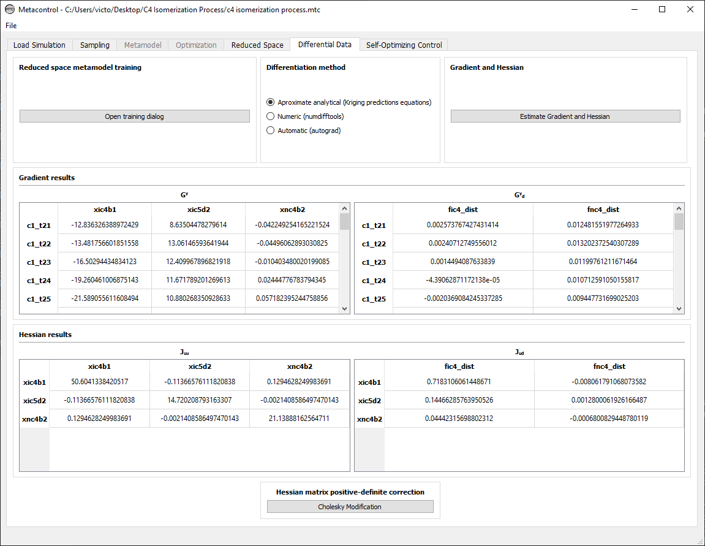

************************
n-Butane Production Unit
************************

.. figure:: ../images/c4isoflowsheet.svg
   :name: c4processflowsheet
   :align: center

   Flowsheet of the C4 isomerization process.

This case-study presented consists in a :math:`C_{4}` isomerization
process, that aims to convert *n*-butane(:math:`n-C_{4}`) into isobutane
(:math:`i-C_{4}`). The latter can be used as an octane-enhancing
gasoline blending agent, and also it is an precursor for isobutyl
alcohol production :cite:`jagtap12`. The process
described in this case-study it is based on the work of
:cite:`jagtap12`: Base operating conditions and optimal
operating ones. The idea of this case study is to depict to reader the
second mode of operation that can be used in *Metacontrol*, described in when the
optimal operating point it is known. This was implemented within because
there is a plethora of papers and discussions over the several years
that addresses the optimization of several processes
(:cite:`jagtap12,jagtap13,araujo07,araujo08,gera13,Liu2019,skoge04`, 
just to name a few), and when one is dealing witheconomic plantwide control 
specially, there are several results that can be anticipated regarding 
active constraints.

Thus, it is understood that there is a relevant number of experienced
researchers that have interest in using the the local methods derived by
:cite:`halvorsen03,alstad09` in order to find
self-optimizing variables (or linear combinations of measurements), but
already know constraints that must be controlled on their particular
applications, specially when this task can be done in a comprehensive
software environment, which is the case for *Metacontrol*. In such cases, 
there is no need to used mode 1 from *Metacontrol*, and the user can simply 
build a metamodel of the reduced-space problem, merely providing the 
simulation file of the process with the active constraints already 
implemented, and sample the process using the unconstrained degrees of 
freedom, in order to generate the necessary high-order data, to finally 
obtain the most promising CV candidates.

The process flowsheet can be found on :numref:`c4processflowsheet`. The 
process was already optimized by :cite:`jagtap12` as stated before. 
Therefore, it was used the previously found optimal point from the 
aforementioned work, and it is described in :numref:`c4optpoint`. 
For this process, :cite:`jagtap12` kept the composition of *n*-butane on 
the bottoms of the purge column constant, and the other variables that
are fixed were active constraints of the optimization problem: Either
anticipated or calculated, except regarding the cooler temperature, that
was alleged to have little impact on the objective function, and it was
kept constant. Therefore, the aforementioned fixed composition will be
considered as an unconstrained degree of freedom, differently from
:cite:`jagtap12`, and the reason is to evaluate if there is another 
variable that is easier to control than a composition that can be used 
in the control structure.

.. table:: C4 Isomerization process optimization summary.
   :name: c4optpoint
   :align: center

   +-----------------------------------+-----------------------------------------------------------------------------------------------------------------------------------------------------------------------------------------------------------------------------------+-----------+
   | Variable                          | Equation                                                                                                                                                                                                                          | Type      |
   +===================================+===================================================================================================================================================================================================================================+===========+
   | Objective Function [:math:`\$/h`] | :math:`J = - 9.83 \times Q_{furnace} - 4.83\times(Q^{reboiler}_{DIB-C}+Q^{reboiler}_{PURGE-C})   - 0.16\times (Q^{condenser}_{DIB-C} + Q^{condenser}_{PURGE-C}) - 32.5\times   F_{C_4} + 42\times F_{i-C_4} + 22\times F_{i-C_5}` | Profit    |
   +-----------------------------------+-----------------------------------------------------------------------------------------------------------------------------------------------------------------------------------------------------------------------------------+-----------+
   | Reactor Temperature Specification | :math:`T_{\mathrm{reactor}}=200^{\circ} \mathrm{C}`                                                                                                                                                                               | Active    |
   +-----------------------------------+-----------------------------------------------------------------------------------------------------------------------------------------------------------------------------------------------------------------------------------+-----------+
   | DIB-C Boilup Constraint           | :math:`0 \leq V_{1} \leq 1.3`                                                                                                                                                                                                     | Base case |
   +-----------------------------------+-----------------------------------------------------------------------------------------------------------------------------------------------------------------------------------------------------------------------------------+-----------+
   | PURGE-C Boilup Constraint         | :math:`0 \leq V_{2} \leq 1.5`                                                                                                                                                                                                     | Base case |
   +-----------------------------------+-----------------------------------------------------------------------------------------------------------------------------------------------------------------------------------------------------------------------------------+-----------+
   | Furnace Constraint                | :math:`0 \leq Q_{\text {furnace }} \leq 1.3`                                                                                                                                                                                      | Base case |
   +-----------------------------------+-----------------------------------------------------------------------------------------------------------------------------------------------------------------------------------------------------------------------------------+-----------+
   | Reactor Pressure Specification    | :math:`$P_{\mathrm{reactor}}=45`                                                                                                                                                                                                  | Active    |
   +-----------------------------------+-----------------------------------------------------------------------------------------------------------------------------------------------------------------------------------------------------------------------------------+-----------+
   | Cooling Specification             | :math:`T_{\mathrm{cooler}}=53^{\circ} \mathrm{C}`                                                                                                                                                                                 | Fixed     |
   +-----------------------------------+-----------------------------------------------------------------------------------------------------------------------------------------------------------------------------------------------------------------------------------+-----------+

In :numref:`c4mainscreen`, it can be seen that the only expression built 
for this problem was the economic objective function, due to the fact 
that the problem is already unconstrained (the active constraints are 
already known). Similarly to the first and second case studies, the user 
must identify the process disturbances, CV candidates and degrees of freedom 
(:numref:`c4variables`).

.. figure:: ../images/c4mainscreen.PNG
   :name: c4mainscreen
   :align: center

   C4 Isomerization process - loading simulation. The cooling water 
   price is positive due to signal convention inside the process simulator - 
   heat removed from the system has a negative sign.

.. figure:: ../images/c4-loadvar.PNG
   :name: c4variables
   :align: center

   C4 Isomerization process - loading variables.

For the expected disturbances, the values come from :cite:`jagtap12`, 
and disturbances for the amounts of isobutane and \textit{n}-butane in the 
feed were considered, with a range of :math:`10\%` of the nominal values. 
However, instead of considering the compositions, the values of the 
individual component flow rates were used in the design of experiments. 
Regarding CV candidates, sensitive temperatures at the optimal operating 
point were inspected for both columns, and the most sensitive ones were 
considered as CV candidates. The full list of CV candidates can be seen 
in :numref:`c4cvs`.

.. table:: CV Candidates for :math:`C_{4}` Isomerization process.
   :name: c4cvs
   :align: center

   +----------------------------------+----------------------------------+
   | **Variable** (alias used in      | **Description**                  |
   | *Metacontrol*)                   |                                  |
   +==================================+==================================+
   | c1_t“x’                          | 1st column stage X temperature   |
   |                                  | (stages 21-33)                   |
   |                                  | :math:`(°C)`                     |
   +----------------------------------+----------------------------------+
   | c2_t“x’                          | 2nd column stage X temperature   |
   |                                  | (stages 14-20)                   |
   |                                  | :math:`(°C)`                     |
   +----------------------------------+----------------------------------+
   | x_ic4_b1                         | 1st column :math:`i-C_{4}`       |
   |                                  | bottoms composition              |
   +----------------------------------+----------------------------------+
   | x_ic5_d2                         | 2nd column :math:`i-C_{5}`       |
   |                                  | distillate composition           |
   +----------------------------------+----------------------------------+
   | x_nc4_b2                         | 2nd column :math:`n-C_{4}`       |
   |                                  | bottoms composition              |
   +----------------------------------+----------------------------------+
   | c1_v                             | 1st column boilup rate           |
   |                                  | :math:`(kmol/h)`                 |
   +----------------------------------+----------------------------------+
   | c2_v                             | 2st column boilup rate           |
   |                                  | :math:`(kmol/h)`                 |
   +----------------------------------+----------------------------------+
   | c1_l                             | 1st column reflux rate           |
   |                                  | :math:`(kmol/h)`                 |
   +----------------------------------+----------------------------------+
   | c1_l                             | 2nd column reflux rate           |
   |                                  | :math:`(kmol/h)`                 |
   +----------------------------------+----------------------------------+

50 points were sampled with an amplitude of :math:`\pm0.5\%` around the optimal 
point (:numref:`c4redspace`), and the gradients and hessians could be 
extracted (:numref:`c4grad`). Lastly, Similarly as the previous cases, the 
implementation error for temperatures was considered as :math:`0.5(°C)`,
:math:`10^{-3}` for flow rates and :math:`10^{-6}` for compositions. All the 
aforementioned data was inserted inside *Metacontrol*, as can be seen in 
:numref:`c4soc`.

   C4 Isomerization process - loading variables.

   C4 Isomerization process - High-order data obtainment.

   C4 Isomerization process - Self-Optimizing Control input.

For the sake of brevity only the single measurement policy was considered in 
this analysis. :numref:`c4socresult` shows that, not surprisingly, the 
control of sensitive temperatures and the composition of the pollutant 
(in this case, :math:`i-C_{5}`), yielded the lowest losses. However, keeping 
temperatures and flow rates with constant setpoints instead of using 
compositions are also promising control structures, as can be seen in 
:numref:`c4socresult2`

.. figure:: ../images/c4-best-cvs.PNG
   :name: c4socresult
   :align: center

   C4 Isomerization process - Single measurements policy: Best CV candidates.

.. figure:: ../images/c4-best-cvs-3.PNG
   :name: c4socresult2
   :align: center

   C4 Isomerization process - Single measurements policy: Best CV candidates 
   not using compositions.

Dynamic simulations
===================

Using the best single measurement policy of :numref:`c4socresult`, the dynamic 
evaluation of the :math:`C_{4}` isomerization process was performed to prove the 
robustness of the SOC-based control structure. The controllers were tuned with 
the IMC tuning rules and disturbances on the feed flow rate and n-butane feed 
composition were made, with the results depicted in the next four figures. 
A process flowsheet depicting the control configuration in place is depicted 
in :numref:`c4controllers`.

   Control structure tested.

.. plot:: images/pyplots/feedplus10.py
   :align: center

.. plot:: images/pyplots/feedminus10.py
   :align: center

.. plot:: images/pyplots/feedcompplus5.py
   :align: center
   
.. plot:: images/pyplots/feedcompminus5.py
   :align: center