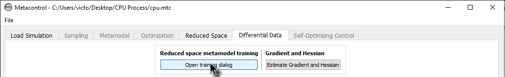
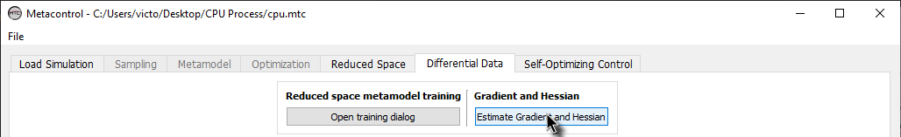

**************************************************
The "Differential Data" tab
**************************************************

At this tab you will extract the high-order data (Gradients and Hessians)
that are necessary in order to calculate the self-optimizing control structures using
the exact local method from :cite:`alstad09`. 

The high-order data is calculated with
analytical expressions derived by :cite:`DACE` and :cite:`alves2018`, using the kriging 
metamodel built for the reduced space problem.

The aforementioned procedure is encapsulated in this tab. You will be able to:

* Generate the gradients and hessians, and inspect them.
* Remove any CV candidate from the list of candidates if you want.

Here is an overview of this tab, before you start using it:

.. figure:: ../images/diff_data_main.png
   :align: center

   Differential Data tab.

There are four main panels on this tab

* Reduced space metamodel training *Panel*
* Gradient and Hessian estimation *Panel*
* Gradient results *panel* and Hessian results *panel*

Reduced space metamodel training *Panel*
========================================

Under this panel, you are able to click on "Open training dialog" in order to
configure your reduced-space kriging metamodel.

Configuring your kriging metamodel
-----------------------------------

Click on "Open training dialog":

   Opening the kriging training dialog window.

You will notice that the window that appears to you is exactly the same from
:ref:`metamodel_tab`. Therefore the process of configuring your reduced-space 
kriging metamodel is essentially the same.

.. figure:: ../images/diff_data_training_dialog_window.png
   :align: center

   Training dialog window.

.. IMPORTANT::
    At the training dialog window, you will notice that only the Candidates that
    were not active constraints are considered now. This happens because *Metacontrol*
    automatically removes the variables that are nominally active (MVs and CVs) based on the
    previous tab (Reduced Space tab). In addition, you can remove any of the remaining CVs, if you
    want. Just *de-select* the box of the variable you want to remove:

    .. figure:: ../images/diff_data_remove_cvs.png
        :align: center

        Removing one variable from the CV candidates list (*fco2out* in this example).

After configuring the hyperparameters estimates, choosing which CVs will be taken into acount in your
metamodel, you can click on "Generate metamodel" in order to inspect the validation metrics of your metamodel.

Acessing performance of your reduced-space metamodel
-----------------------------------------------------

For the reduced-space metamodel, one additional metric has been added in order to help you to evaluate the
robustness of the metamodel generated. It corresponds to the objective function of the maximum likelihood estimation
from the work of :cite:`DACE`. Values under 1e-5 will give robust estimation of the gradients and hessians. (Check :ref:`our_papers`
and the :ref:`theory_tab` section where we give some examples and discuss the theoretical background in detail)

.. figure:: ../images/diff_data_dace_function.png
   :align: center

   Evaluating reduced space kriging metamodel estimation capabilities. Highlighted in blue,
   the value of the optimized objective function value, that results in the optimal hyperparameters estimation.

Gradient and Hessian estimation *Panel*
==========================================

After configuring the kriging metamodel options under the training 
dialog window, you can click on "Estimate Gradient and Hessian", to generate the
high-order data.

   Generating high-order data.

Gradient results *panel* and Hessian results *panel*
=====================================================

After performing the previous step, you will notice that the panels for Gradients and Hessians are now
completed:

.. figure:: ../images/diff_data_completed.png
   :align: center

   Generating high-order data.

If you take a closer look, you will notice that the matrices are in a Dataframe format, making them easy to ready
and to understand each element of the matrices generated. Note that the elements are indexed using the aliases that you
created. For example, the gain between the unconstrained degree of freedom (*mccp*) and one CV candidate (*co2rrcv*) is easily
read:

.. figure:: ../images/diff_data_reading_gains.png
   :align: center

   Generating high-order data.

The same is true for every element of the gradients and hessians calculated.

After the procedure here described, you can go to the last tab: Self-Optimizing Control.

