**************************************************
The "Load Simulation" tab
**************************************************

This is *Metacontrol* initial tab, where you will be able to

* Supply an Aspen Plus simulation file;
* Create aliases for the Aspen Plus simulation variables, to ease the study;
* Select your relevant variables (Manipulated Variables, Controlled Variables and Auxiliary Variables);
* Inspect information about the simulation you provided;
* Create user-defined expressions for Objective functions, Constraints and CVs that are not natively calculated by the process simulator.

.. figure:: ../images/loadsimtab.png
   :align: center

   *Metacontrol* "Load Simulation" tab.

There are four main panels on this tab:

* Load simulation file *panel*
* Selected variables aliases *panel*
* Functions definitions *panel*
* Simulation info *panel*

Load simulation file *panel*
============================

This is the panel that you will use to load the Aspen Plus simulation file.

.. figure:: ../images/loadsim_panel.png
   :align: center

   *Metacontrol* "Load Simulation file" panel.

Providing a simulation file
----------------------------

Clicking on "Open File", a window will appear in your screen and you will
be able to point to your Aspen Plus file location on your PC.

.. figure:: ../images/point_bkp.png
   :align: center

   Pointing to your Aspen Plus file Location.

.. IMPORTANT::
   The supported Aspen Plus file extension is .bkp (Aspen Plus backup file).
   Please, save your simulation with this format before using *Metacontrol*.

.. ATTENTION::
   **Make sure the file supplied is not your only copy!** We can not guarantee 
   that any eventual use by the *Metacontrol* OLE/COM will not cause 
   permanent modification, damage or corruption to your file.

Choosing your variables, and associating aliases for them
----------------------------------------------------------

After pointing to your Aspen Plus simulation file location, the button "Load Variables"
becomes active. After clicking on it, a screen to select simulation variables and adding aliases for
them will appear. Just click on "Load Variable tree", and the Aspen Plus engine will be loaded on background
and all the variable tree will be loaded.

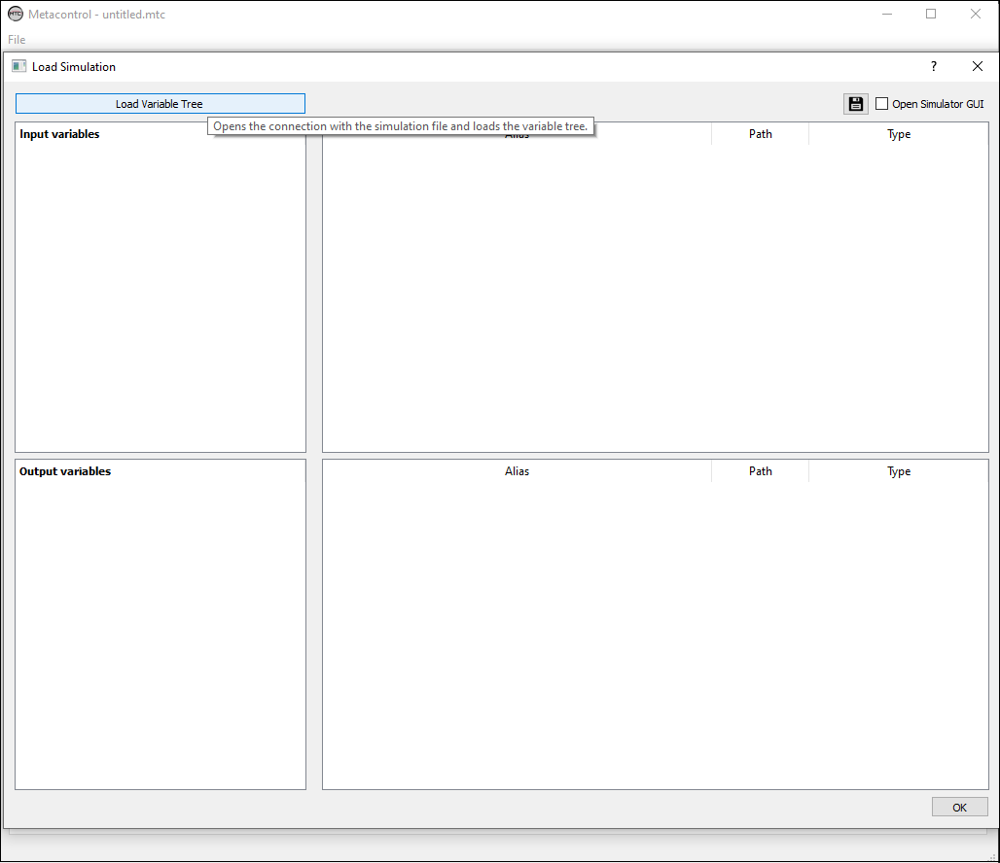

   Loading Variables from Aspen Plus simulation.

After clicking "Load Variable tree" button, you will see that the variables from the simulation are available
for use. They are neatly organized between Input and Output variables, and organized for each block and stream 
that you have modelled in Aspen Plus. If you want a specific variable, simply navigate using the loaded tree, and select it.

.. figure:: ../images/var_tree_filling.png
   :align: center

   Selecting the loaded Variables from Aspen Plus simulation.

.. IMPORTANT::
   If you hover you mouse pointer over a variable from the tree, *Metacontrol* will show the
   description of that variable.
      
      .. figure:: ../images/hover_mouse_description.png
         :align: center

         A quick reminder of what that variable actually is...

On the screen above you noticed a red form over the *alias* and *type* forms. This is intentional: *Metacontrol* is
informing you that two variables are with the same aliases and also, that you did not classified the type of the variables that
you entered. Giving proper (non-repeated) aliases and correctly classifying your variables will make the red warning disappear.

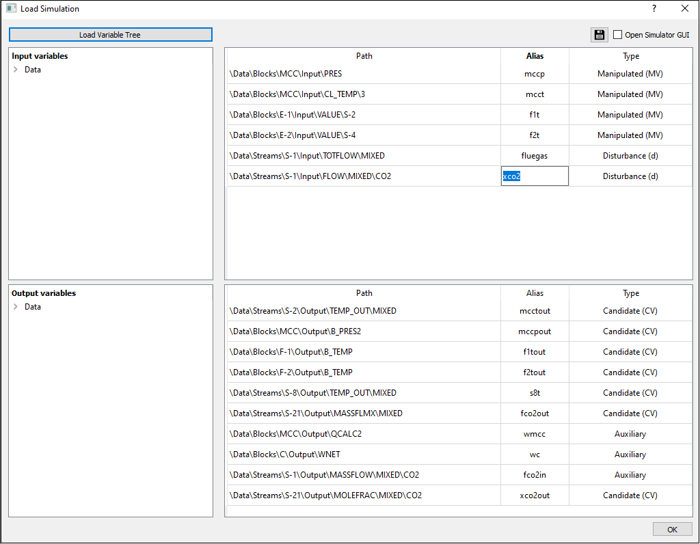

   Typing aliases for variables in *Metacontrol*.

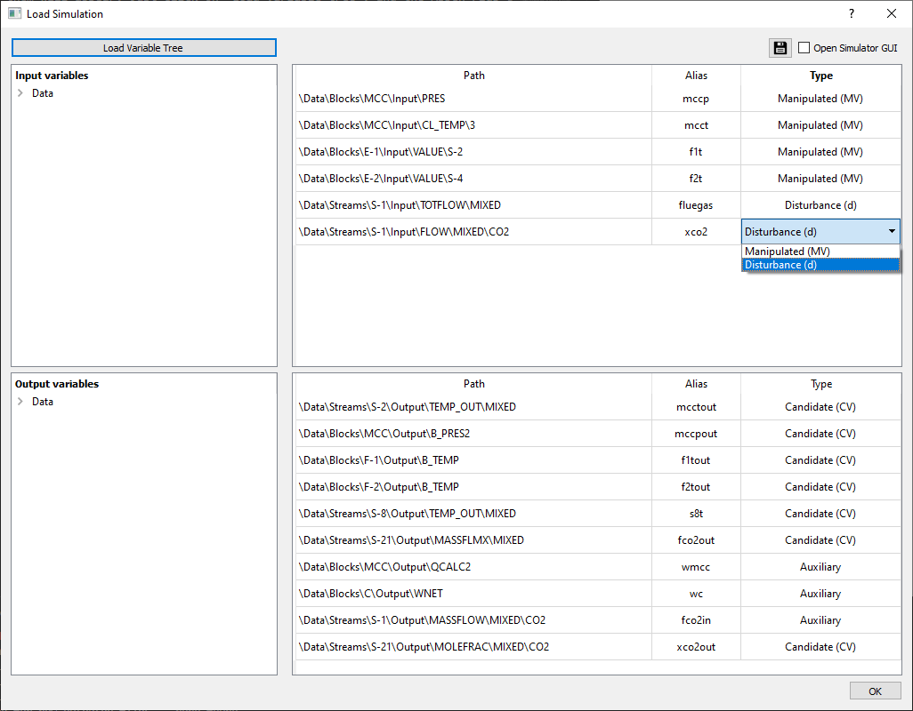

   Classifying your variables in *Metacontrol* - Input Variables.

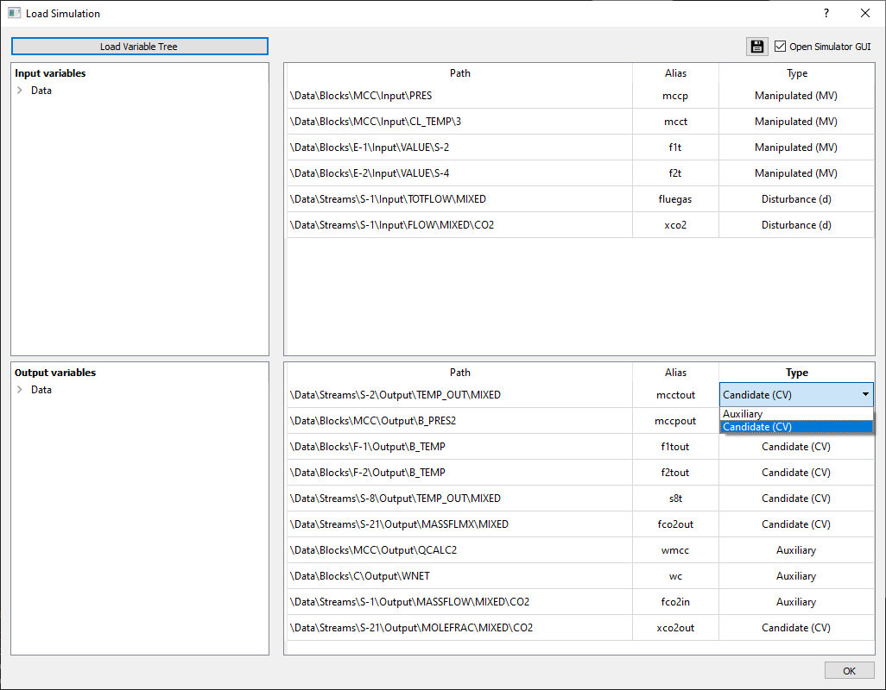

   Classifying your variables in *Metacontrol* - Output Variables.

.. IMPORTANT::
    To create aliases in *Metacontrol*, only lower case alphanumeric characters are allowed.

If you forgot something from you model (a stream name, block, etc.), You can show the simulator GUI (Aspen Plus)
by just checking the "Open Simulator GUI" checkbox on the upper right corner of the variable tree load window.

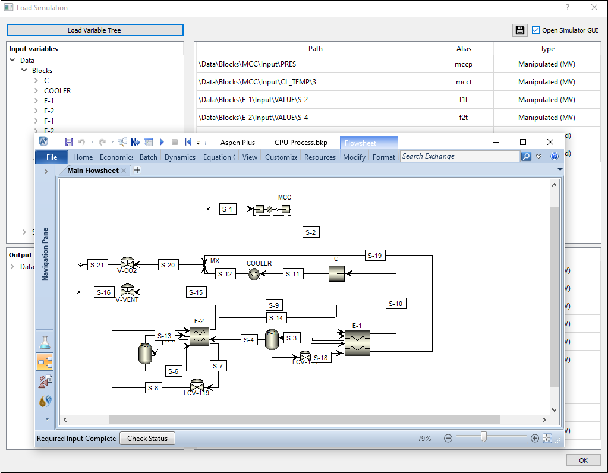

   Forgot something (We do all the time)? Just call Aspen Plus from *Metacontrol*, and have a quick reminder.

After selecting, naming and classifying all the variables that you need, just click "Ok", and you will be back on the main-screen.

Selected variables aliases *panel*
==================================

After selecting the necessary variables, you will see that now on the main tab, this panel reports a list of all variables from your study.
This was created to make it easier for you to remember the aliases of the variables that you created and which type of variable you gave to
each one of them (CV candidate, MV, Auxiliary).

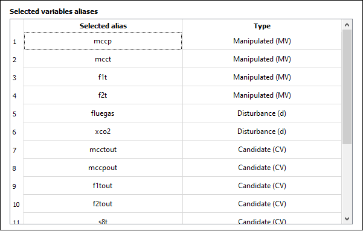

   At the "Load Simulation" tab, a list of all variables that you choose.

Functions definitions *panel*
==================================

On this panel, you can create user-defined variables, using the variables that you previously choose from your Aspen Plus model.
This is really convenient because it allows you to:

* Create the objective function that you will optimize in *Metacontrol*
* Create constraints for your optimization problem
* Create CV Candidates that are not natively calculated by the process simulator (A difference between variables, ratios, product, etc.)

.. figure:: ../images/function_def_panel.png
   :align: center

   The functions definition panel.

The Function definitions panel allow several math operations and functions:

+-------------+----------------------------------------+
| Expression  | Definition                             |
+=============+========================================+
| `+`         | Addition                               |
+-------------+----------------------------------------+
| `-`         | Subtraction                            |
+-------------+----------------------------------------+
| `*`         | Multiplication                         |
+-------------+----------------------------------------+
| `/`         | Division                               |
+-------------+----------------------------------------+
| `^`         | Potentiation                           |
+-------------+----------------------------------------+
| PI          | PI constant                            |
+-------------+----------------------------------------+
| E           | Euler's number                         |
+-------------+----------------------------------------+
| sin(x)      | Sine function                          |
+-------------+----------------------------------------+
| cos(x)      | Cosine function                        |
+-------------+----------------------------------------+
| tan(x)      | Tangent function                       |
+-------------+----------------------------------------+
| asin(x)     | Arcsine function                       |
+-------------+----------------------------------------+
| acos(x)     | Arccosine function                     |
+-------------+----------------------------------------+
| atan(x)     | Arctangent function                    |
+-------------+----------------------------------------+
| log(x)      | Natural Logarithm function             |
+-------------+----------------------------------------+
| log(x,base) | Logarithm function with specified base |
+-------------+----------------------------------------+
| abs(x)      | Absolute value of a number             |
+-------------+----------------------------------------+
| ceil(x)     | Round up to the closest integer        |
+-------------+----------------------------------------+
| floor(x)    | Round down to the closest integer      |
+-------------+----------------------------------------+
| round(x)    | Round to the closest integer           |
+-------------+----------------------------------------+
| exp(x)      | Exponential function                   |
+-------------+----------------------------------------+

The functions definition panel also checks the spelling of your expressions. Missed a *minus* signal between two variables?
Mistype the name of an alias? *Metacontrol* will indicate that to you, with a red color:

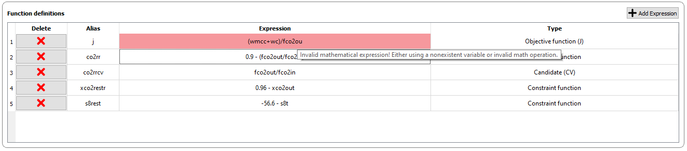

   An example of an alias mistype (missing a "t" from "fco2out" alias).

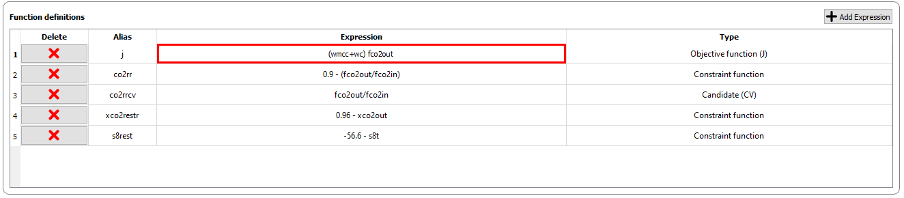

   An example of math mistype (Math operator missing between the two parts of the expression).

Correcting the spelling/operator errors, *Metacontrol* validates your expressions:

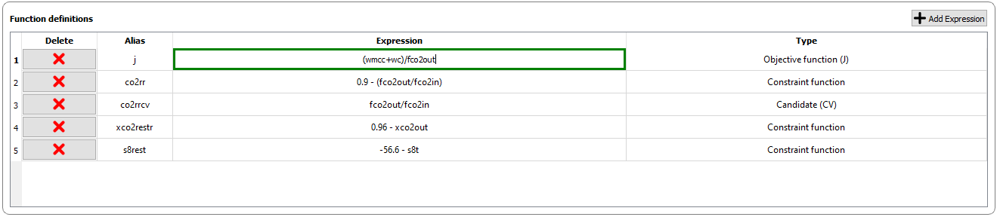
   

   Valid expression becomes green!

Creating a User-Defined Objective function
-------------------------------------------

1. Click "Add Expression":

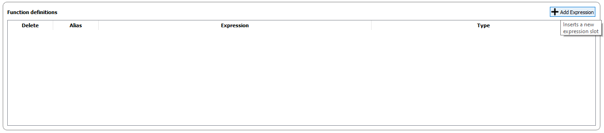

2. Create your desired expression for the Objective function (and name it) to be optimized by *Metacontrol*
later on your study:

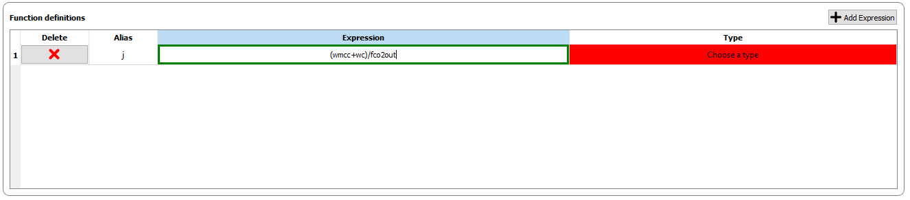

3. Classify it as an Objective Function using the dropdown list:

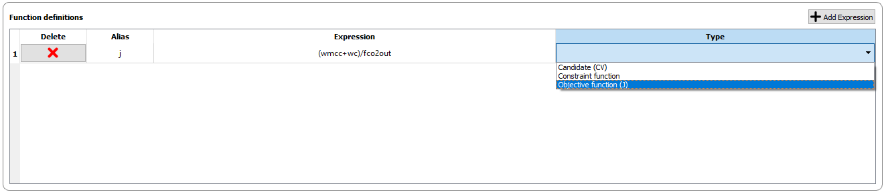

Creating a User-Defined CV Candidate
-------------------------------------
1. Click "Add Expression":

2. Create your desired expression for the CV candidate, based on model measurements that you 
associated aliases with:

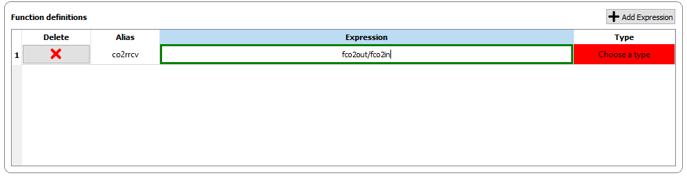

3. Classify it as an CV candidate using the dropdown list:

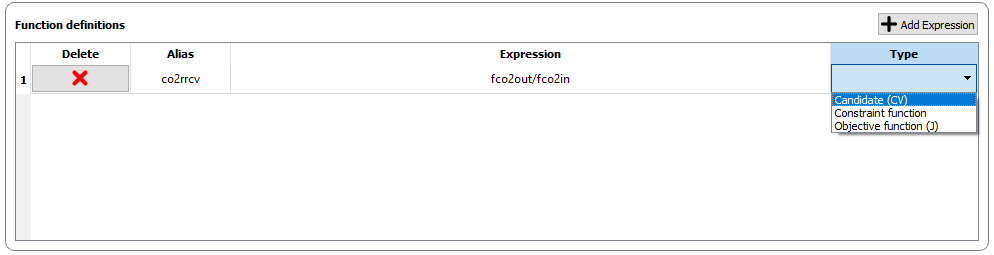

Creating a Constraint function
-------------------------------

It is very common to have process constraints in the processes that you
want to study in a plantwide (Self-Optimizing) perspective. *Metacontrol* supports the
creation of constraints that are added to the optimization problem solved using metamodels.
The constraints are always written in the form:

.. math:: 
    g(x) \leq 0

And you should provide the constraint with such syntax to *Metacontrol*. For instance, the
following product purity CO2 constraint in a compression and purification plant:

.. math:: 
    x_{CO2} \geq 0.96

Must be provided as:

.. math:: 
    0.96 - x_{CO2} \leq 0

Within *Metacontrol*, you should simply type:

.. figure:: ../images/constraint1type.png
   :align: center

You can also create constraints that are expressions. For example:

.. figure:: ../images/constraint2type.png
   :align: center

which is:

.. math:: 
    fco2out/fco2in \geq 0.9

If you have an constraint interval, simply break it into two constraints 
(A lower bound and an upper bound constraint).

Simulation info *panel*
=======================

This panel serves as a "At a glance" simulation data info panel: After you load your Aspen Plus simulation,
it is possible to inspect the following information:

* Number and name of components
* Thermodynamic Package used in your model
* Number and name of blocks used
* Number and name of streams in your flowsheet
* Chemical Reactions modeled
* If there are any sensitivity analysis, optimizations, calculators and/or Design Specifications Within your model.

.. ATTENTION::
   You might want to **disable** any **sensitivity analysis** and **optimization blocks** that exist inside
   your simulation. Note that *Metacontrol* is going to perform a DOE (Design of Experiments)
   using your model in order to create a kriging interpolator and later optimize it. If you keep a sensitivity analysis
   turned on, for instance, the results of the DOE will be superseded by the sensitivity analysis. In addition, if you have an optimization block
   active: Aspen Plus will try to optimize at each run. **We certainly do not want this**.

   
The following image shows an example of the Simulation info *panel* after you load a simulation:

.. figure:: ../images/sim_info_panel.png
   :align: center

   Simulation info panel showing information regarding the Aspen Plus model provided.