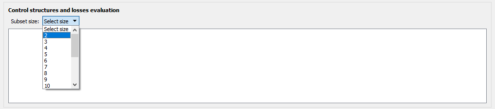
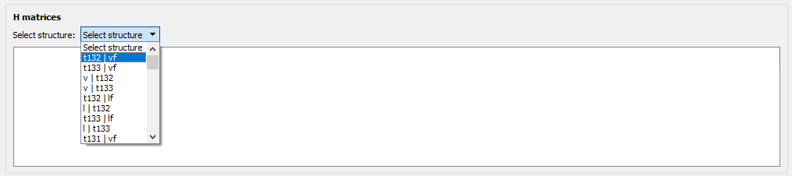
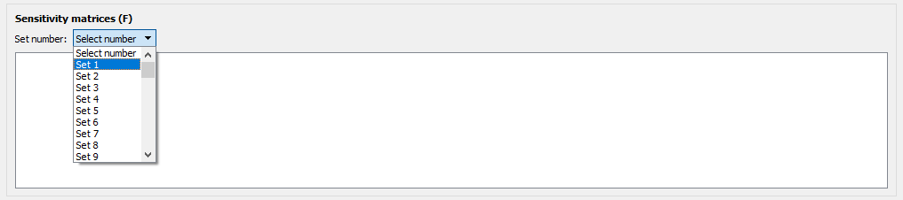

=================================
The "Self-Optimizing Control" tab
=================================

At this tab the self-optimizing control structure selection is made. You will be able to:

* Provide the expected *disturbances* and *implementation/measurement* magnitudes to be taken
  into account in your study
* Inform *Metacontrol* how many  **best** (that incurs in the lowest loss) structures do you want to analyze for each possible control structure subset size
* Inspecting in *ascending* and *descending* order all evaluated control structures
* Inspect the `condition number <http://folk.ntnu.no/skoge/vgprosessregulering/lectures/old/rga.pdf>`_ of each control structure
* Inspect linear combinations of controlled variables, if you chose to analyze more CV candidates than the unconstrained degrees of freedom available.

This tab looks like the picture below, before you start to fill the necessary data:

.. figure:: ../images/soc_main_tab_before_completion.png
   :align: center

   *Metacontrol* "Self-Optimizing Control" tab.

The forms are red because you need to supply the data for the disturbances and implementation/measurement errors magnitudes.

There are three panels at this tab:

* Disturbances magnitude *panel*
* Measurement error *panel*
* Subsets sizing options *panel*

Disturbances magnitude *panel*
===============================

At this panel, you will inform to *Metacontrol* the expected magnitude of the disturbances. 
As an example, see the figure below, where it was considered 10% of the nominal value for
the variables *fpropan*, *fpropy* and *vfrac*:

.. figure:: ../images/soc_disturbances_magnitude_panel.png
   :align: center

   Entering disturbances expected magnitudes.

Measurement error *panel*
=========================

At this panel, you will enter the expected implementation/measurement error. For the example on the figure
below, it was considered 0.5°C for temperature measurements and 0.001 for flow measurements.

.. figure:: ../images/soc_measurement_error_panel.png
   :align: center

   Entering measurement error expected magnitudes.

Subsets sizing options *panel*
===============================

At this panel you will determine how many *best* control structures will be reported to you by *Metacontrol*, 
for each possible subset size:

.. figure:: ../images/soc_subset_sizing_options_panel.png
   :align: center

   Entering measurement error expected magnitudes.

*Metacontrol* and the maximum number of possible control structures for each subset size
-----------------------------------------------------------------------------------------

*Metacontrol* automatically calculates the maximum number of possible control structures for 
each subset size. 

For the example shown in the previous figure, there are 20 CV candidates and two unconstrained degrees of freedom 
available. For a single measurement policy (using one single CV candidate for each MV) there are

.. math:: 
    (20! / 2!) = 20!/(2! \times (20-2)!) = 190

possible control structures. If the user tries to evaluate 191 (which is impossible), *Metacontrol* will prevent him
from doing this:

.. figure:: ../images/soc_subset_sizing_impossible.png
   :align: center

   *Metacontrol* avoiding impossible evaluations.

Analyzing your results
=======================

After completing this tab with the all necessary data, you can click on "Generate Results", and a window will
appear:

.. figure:: ../images/soc_results_review.png
   :align: center

You can select which subset size you want to analyze:

The linear combinations generated for the possible control structures:

And the sensitivity matrices for each possible control structure evaluated:

In addition, you can arrange the control structures in *ascending* and *descending* loss value order, to ease
your study:

.. figure:: ../images/soc_ascending_size2.png
   :align: center

.. figure:: ../images/soc_descending_size2.png
   :align: center

For any subset size! For example, linear combinations of 6 measurements for this particular case shown here for
illustration purposes:

.. figure:: ../images/soc_size6.png
   :align: center

And inspect other controllability measures, such as the condition number (highlighted with a black-box):

.. figure:: ../images/soc_condition_number.png
   :align: center

