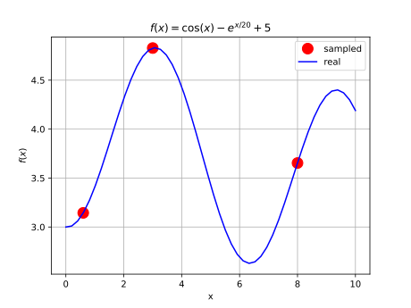
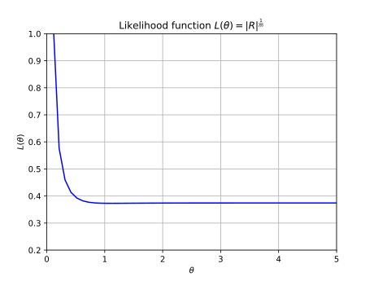
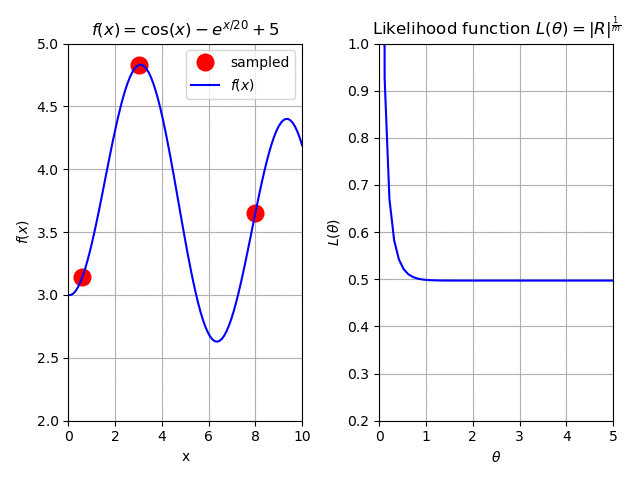

******************************
Surrogate modeling - Kriging
******************************

Metamodels are a way to represent the world in simpler terms. Think of them as 
a photograph, they do not capture the moment as whole but can represent it 
good enough. In this analogy, the moment is a complex process that it is too 
cumbersome to explain it completely in mathematical terms, and metamodels, as 
photographs, may serve the purpose of capturing the core trends of this 
process without being too unwieldy and not losing too much information.

There is a family of metamodeling methodologies, ranging from a simple linear 
regression to complex neural networks. However, the surrogate methodology 
currently implemented in *Metacontrol* is the *Kriging*.

The simplest form to represent a real world process (:math:`y`) through a 
metamodel (:math:`\hat{y}`) and its error (:math:`\varepsilon`) is done 
through :eq:`surreq`.

.. math::
    :label: surreq
    
    y(x) = \hat{y}(x) + \varepsilon

The error (:math:`\varepsilon`) is associated with the unmodeled effects of 
the inputs (:math:`x`) and random noise (i.e. it cannot be explained in detail 
but cannot be ignored as well.). When using the *Kriging* methodology as 
metamodel, this error is assumed to be a probabilistic function of :math:`x`, or 
in other words, this error is assumed to be **not** independent and identically 
distributed. The specific probabilistic function is represented by a Gaussian 
distribution with mean (:math:`\mu`) zero and variance :math:`\sigma^2`.

As from :cite:`DACE`, a *Kriging* metamodel :math:`\hat{y}(x)`, of a 
rigorous model :math:`y(x)` of :math:`q` dimensions, is comprised 
of two parts: a polynomial regression (:math:`\mathcal{F}`) and departure 
function (:math:`z`) of stochastic nature:

.. math::
    \hat{y}_{l}(x)=\mathcal{F}\left(\beta_{:, l}, x\right)+z_{l}(x), 
    \quad l=1, \ldots, q

The regression model, considered as a linear combination of (:math:`t`) 
functions (:math:`f_{j}: \mathbb{R}^{n} \rightarrow \mathbb{R}`), as defined 
in :eq:`kr2`.

.. math::
    :label: kr2

	\mathcal{F}\left(\beta_{:, l}, x\right) \equiv f(x)^{T} \beta_{:, l}

The most common choices for :math:`f(x)` are polynomials with orders ranging 
from zero (constant) to two (quadratic). It is assumed that :math:`z` has 
mean zero, and the covariance between to given points, arbitrarily named 
:math:`w` and :math:`x` for instance, is defined by :eq:`kr3`:

.. math::
    :label: kr3

    \operatorname{Cov}\left[z_{l}(w), z_{l}(x)\right]=\sigma_{l}^{2} 
    \mathcal{R}\left(\theta_{l}, w, x\right), \quad l=1, \ldots, q

With :math:`\sigma_{l}^{2}` being the process variance for the *lth* response 
component, and :math:`\mathcal{R}(\theta, w, x)` defined as the correlation 
model. In *Metacontrol*, the correlation model used is described by :eq:`kr4`.

.. math::
    :label: kr4

    \mathcal{R}\left(\theta_{l}, w, x\right)=\exp \left(-\sum_{i=1}^{m} 
    \theta_{l}\left(w-x_{i}\right)^{p}\right), \quad\left(\theta_{l} \geq 0, 
    p_{l} \in[0,2]\right)

The hyperparameters :math:`\theta` are degrees of freedom available for 
optimization purposes, seeking the improvement of the metamodel fitness. In 
:cite:`DACE`, the optimal set of hyperparameters :math:`\theta^*` corresponds 
to the maximum likelihood estimation. Assuming a Gaussian process, the optimal 
values of the hyperparameters are the ones that minimize :eq:`kr5`:

.. math::
    :label: kr5

    \min _{\theta}\left\{\psi(\theta) \equiv|R|^{\frac{1}{m}} 
    \sigma^{2}\right\}

Where :math:`|R|` is the determinant of the correlation matrix. The internal 
optimizer used in *DACE* toolbox corresponds to a modified version of 
the *Hooke & Jeeves* method, as showed by :cite:`dacereport`.

As stated before, high-order data obtainment it is an obligatory step in the 
proposed methodology implemented in \mtc. Fortunately, :cite:`DACE` 
also derived expressions for Jacobian (:math:`\hat{y}^{\prime}(x)`) 
evaluation of a *Kriging* prediction, given in :eq:`kr6`:

.. math::
    :label: kr6

	\hat{y}^{\prime}(x)=J_{f}(x)^{T} \beta^{*}+J_{r}(x)^{T} \gamma^{*}

The expression for Hessian evaluation was derived by :cite:`alves2018` 
(full demonstration in appendix A of their work), and it is depicted in 
:eq:`kr7`:

.. math::
    :label: kr7

	\hat{y}^{\prime \prime}(x)=H_{f}(x) \beta^{*}+H_{r}(x) \gamma^{*}

Equations :eq:`kr6` and :eq:`kr7` are one of the staples of the *Metacontrol*.

How to tell if my surrogate is good or not?
===========================================

To fit our *Kriging* metamodel correctly, the most straightfoward way is to 
analyze the values returned by :eq:`kr5` to determine if the likelihood 
function is at its minimum or not. 

Suppose a complex process that we need to substitute by a surrogate that is 
represented by the following function:

.. math::
    :label: complex

    f(x) = -\cos(x) - e^{\frac{x}{20}} + 5

Due to some constraints (i.e. the model is too expensive or slow to compute), 
we can only have a small amount of samples (red circles). For inspection
purposes, we decide to spend some of our "budget" and sample three points 
initially. Plotting this model we have:

    Plot of function :eq:`complex`. The blue line is the true behavior of the
    model.

Plotting the equation :eq:`kr5`, we se that this initial sample of three points 
gives use a monotonic behavior (you could say it's "plateuing") for the 
likelihood function. Or in simpler terms, there is no clear discernible 
minimum. This will, likely, result in a poor fit.

    Initial plot of the likelihood :eq:`kr5` as function of the hyperparameters 
    :math:`\theta`.

So what is the solution for this? We decide to spend a bit more of our budget 
and add four more samples to the fit. Again, we plot the results iteractively to 
demonstrate the effect:

    The effect of adding more samples to our surrogate.

As we can see, the more we add to the initial sample, the better is to find a 
minimum for :eq:`kr5`.

.. CAUTION::
    In this case, we used a simple function for demonstration purposes. When 
    dealing with way more complex models, the "budget" we mentioned earlier 
    is the computational effort of the *Kriging* metamodel, since it has a 
    :math:`\mathcal{O}(n^3)` complexity, there is a trade-off between sample 
    size and how satisfied we are with our surrogate.

However, now you may question: "With higher dimensions models, we can't simply 
plot this function and do this analysis. So what should I do?"

The answer is simple. If you look closely at :numref:`theta_anim`, you may 
notice that as :math:`\theta` increases, the likelihood reaches its plateau. 
This behavior is due to that :math:`R` (or :eq:`kr4`) tends to become an 
identity matrix with high values of :math:`\theta` (i.e. there is no 
correlation). When this happens, :eq:`kr5` approximates to the variance 
:math:`Var(y)` of the sample :math:`y`.

Therefore a simple way to examine our quality-of-fit is to test the following 
equation:

.. math::
    :label: psi_eval

    \psi(\theta^*) < Var(y)

.. IMPORTANT::
    If :eq:`psi_eval` is true at the optimal :math:`\theta^*`, then, probably, 
    the fit is good enough for our purposes. Otherwise, the model is, 
    most likely, a poor fit.